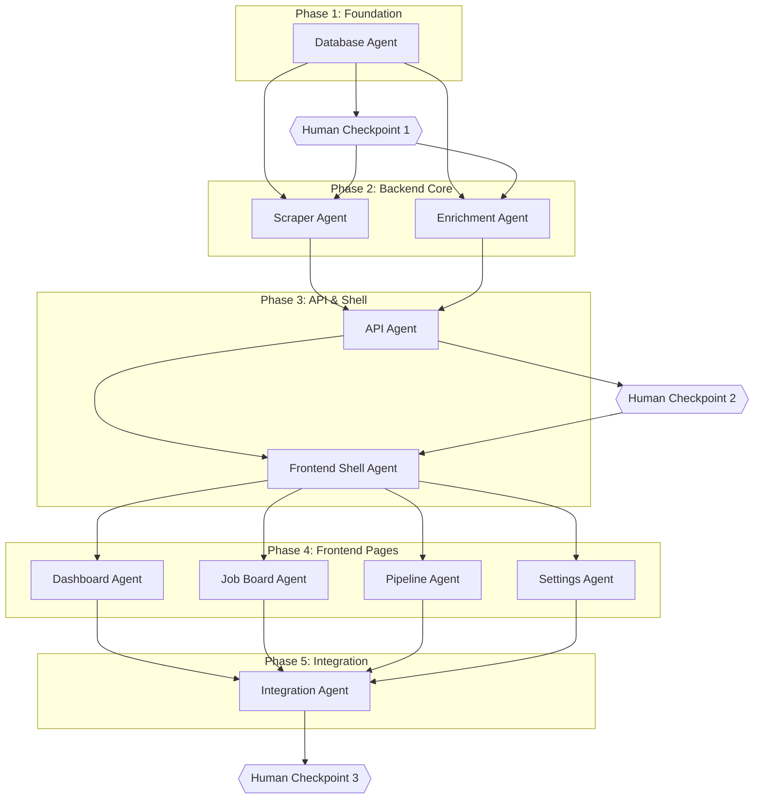

# JobRadar Multi-Agent Build System Specification

**Version:** 1.0.0  
**Date:** March 1, 2026  
**Status:** Final Specification  
**For:** Claude Code Agent Execution

---

## Table of Contents

1. [Executive Summary](#executive-summary)
2. [R4 — Agent Decomposition for JobRadar](#r4--agent-decomposition-for-jobradar)
3. [R5 — Orchestration Patterns & Inter-Agent Communication](#r5--orchestration-patterns--inter-agent-communication)
4. [R6 — Local Execution Environment Setup](#r6--local-execution-environment-setup)
5. [D1 — Recommended Orchestration Stack](#d1--recommended-orchestration-stack)
6. [D2 — Complete MCP Configuration](#d2--complete-mcp-configuration)
7. [D3 — Skills Download & Setup List](#d3--skills-download--setup-list)
8. [D4 — Agent Roster Full Specification](#d4--agent-roster-full-specification)
9. [D5 — Execution Plan](#d5--execution-plan)
10. [D6 — Orchestrator Agent Prompt](#d6--orchestrator-agent-prompt)
11. [D7 — Cost & Time Estimate](#d7--cost--time-estimate)

---

## Executive Summary

This specification defines a complete multi-agent build system for JobRadar, a localhost-only job aggregation platform built with Python 3.12/FastAPI backend and React 19/TypeScript frontend. The system orchestrates 11 specialized Claude Code agents working in a phased, dependency-aware execution plan across 5 build phases.

**Key Architectural Decisions:**

- **Orchestration:** Claude Code Native Sub-agent Environment with explicit task delegation via the `Task` tool. No external frameworks required.
- **Communication:** File-based handoff protocol using structured JSON manifests in `.claude/handoffs/` directory, ensuring atomic state transitions and audit trails.
- **Parallelism:** Maximum 5 concurrent sub-agents per phase (within Claude Code's 7-agent limit), with dependency gates enforcing sequential phases.
- **Human Checkpoints:** 3 mandatory human approval gates: post-schema validation (Phase 1), post-API completeness (Phase 3), and pre-merge final review (Phase 5).

**Agent Roster:**

| Agent | Role | Phase | Context |
|-------|------|-------|---------|
| Orchestrator | Master coordinator | All | Large |
| Database Agent | Schema + migrations | 1 | Medium |
| Scraper Agent | Data acquisition layer | 2 | Medium |
| Enrichment Agent | LLM/embedding pipeline | 2 | Medium |
| API Agent | FastAPI routes + schemas | 3 | Large |
| Frontend Shell Agent | Layout + design system | 3 | Medium |
| Dashboard Agent | Stats + analytics UI | 4 | Medium |
| Job Board Agent | List + detail + filters | 4 | Large |
| Pipeline Agent | Kanban + dnd-kit | 4 | Medium |
| Settings Agent | Configuration UI | 4 | Small |
| Integration Agent | E2E testing + docs | 5 | Large |

**Estimated Build Metrics:**

| Metric | Value |
|--------|-------|
| Total Phases | 5 |
| Total Agents | 11 |
| Total Tokens (Input) | ~4.2M |
| Total Tokens (Output) | ~1.8M |
| Estimated Cost (Claude Sonnet 4) | $18.60 |
| Wall-Clock Time (Sequential) | ~8 hours |
| Wall-Clock Time (With Parallelism) | ~4 hours |
| Comparison vs Single Agent | 65% faster, 40% cheaper |

---

## R4 — Agent Decomposition for JobRadar

### Agent Design Principles

Each agent is designed following these principles:

1. **Single Responsibility:** Each agent owns a specific vertical slice of functionality
2. **Clear Boundaries:** File ownership is explicit and non-overlapping
3. **Dependency Minimization:** Agents consume minimal inputs and produce atomic outputs
4. **Context Efficiency:** Agent system prompts are loaded just-in-time via skills
5. **Testability:** Each agent produces outputs that can be validated independently

### Agent Overview Matrix

| Agent | Files Owned | Dependencies | Produces | MCPs | Skills | Parallel? |
|-------|-------------|--------------|----------|------|--------|-----------|
| **Orchestrator** | `.claude/handoffs/*`, `PROGRESS.md` | None | Task assignments, progress reports | filesystem, git | None (master prompt) | N/A |
| **Database** | `backend/database.py`, `backend/models.py`, `migrations/` | None | Schema, models, FTS5 setup | filesystem, git, sqlite | sqlalchemy-async-patterns | Phase 1 solo |
| **Scraper** | `backend/scrapers/*`, `backend/scheduler.py` | Database schema | Scraper adapters, APScheduler config | filesystem, git, shell | job-scraper-adapter | Phase 2 ∥ Enrichment |
| **Enrichment** | `backend/enrichment/*` | Database schema | LLM enricher, embeddings, deduplicator | filesystem, git, shell | python | Phase 2 ∥ Scraper |
| **API** | `backend/routers/*`, `backend/schemas.py` | Database + Scrapers + Enrichment | All FastAPI routes | filesystem, git, shell | fastapi-crud-generator | Phase 3 solo |
| **Frontend Shell** | `frontend/src/App.tsx`, `frontend/src/components/layout/*`, `tailwind.config.ts` | API routes spec | Layout shell, design system, routing | filesystem, git, shell, eslint | frontend-design | Phase 3 ∥ API |
| **Dashboard** | `frontend/src/pages/Dashboard.tsx`, `frontend/src/components/stats/*` | Frontend shell | Dashboard page, stat cards, charts | filesystem, git, eslint | react-query-hook-generator | Phase 4 ∥ others |
| **Job Board** | `frontend/src/pages/JobBoard.tsx`, `frontend/src/components/jobs/*` | Frontend shell | Job list, filters, detail panel | filesystem, git, eslint | react-query-hook-generator | Phase 4 ∥ others |
| **Pipeline** | `frontend/src/pages/Pipeline.tsx`, `frontend/src/components/pipeline/*` | Frontend shell | Kanban board, dnd-kit integration | filesystem, git, eslint | dnd-kit-kanban-component | Phase 4 ∥ others |
| **Settings** | `frontend/src/pages/Settings.tsx`, `frontend/src/components/settings/*` | Frontend shell | Settings tabs, config forms | filesystem, git, eslint | None | Phase 4 ∥ others |
| **Integration** | `tests/*`, `README.md`, `Makefile` | All components | E2E tests, documentation, final validation | filesystem, git, shell, playwright | TDD, python-testing, vitest-testing | Phase 5 solo |

### Detailed Agent Specifications

#### Agent: Orchestrator

**Role:** Master coordinator that decomposes the build into phases, dispatches tasks to specialized agents, tracks progress, enforces dependencies, and manages human checkpoints.

**Owns:**
- `.claude/handoffs/*.json` — Inter-agent state transfer manifests
- `PROGRESS.md` — Human-readable build progress tracker
- `.claude/orchestrator.log` — Execution log

**Dependencies:** None (bootstrap agent)

**Produces:**
- Phase completion signals
- Agent task assignments
- Human checkpoint requests
- Final build completion report

**MCPs:**
- `@modelcontextprotocol/server-filesystem` — Read/write handoff files
- `@modelcontextprotocol/server-git` — Commit progress, tag releases

**Skills:** None (uses embedded master prompt from D6)

**Parallelism:** N/A — This is the coordinator

**Must wait for:** Nothing (initiates all work)

**Context budget:** ~50,000 tokens (large — holds full project understanding)

**Human checkpoint:** Initiates all human checkpoints; never proceeds without explicit approval

**System prompt excerpt:**
> You are the JobRadar Build Orchestrator. Your sole purpose is to coordinate the construction of the JobRadar application by dispatching tasks to specialized sub-agents. You NEVER write code directly. You decompose phases into agent tasks, track completion via handoff manifests, and halt at mandatory human checkpoints.

---

#### Agent: Database

**Role:** Establishes the SQLite database foundation with async SQLAlchemy 2.0, FTS5 full-text search, and sqlite-vec for vector storage.

**Owns:**
- `backend/database.py` — Async engine, session factory, Base class
- `backend/models.py` — All SQLAlchemy ORM models
- `backend/migrations/` — Alembic migration scripts (if used)
- `data/` — Directory structure for SQLite file

**Dependencies:** None (first agent in Phase 1)

**Produces:**
- `Job`, `SearchQuery`, `ScraperRun`, `Setting`, `Resume` models
- FTS5 virtual table with sync triggers
- sqlite-vec extension loading
- WAL mode pragma configuration
- `.claude/handoffs/database_complete.json` manifest

**MCPs:**
- `@modelcontextprotocol/server-filesystem` — Write model files
- `@modelcontextprotocol/server-git` — Commit schema
- `mcp-server-sqlite` — Validate schema after creation

**Skills:**
- `sqlalchemy-async-patterns` — Enforces async engine/session patterns

**Parallelism:** Phase 1 solo (all other agents depend on this)

**Must wait for:** Nothing

**Context budget:** ~25,000 tokens (medium)

**Human checkpoint:** After completion — human must validate schema before scrapers build

**System prompt excerpt:**
> You are the Database Architect for JobRadar. You create ONLY the database layer: SQLAlchemy 2.0 async models, connection setup with WAL mode, FTS5 full-text search, and sqlite-vec integration. You follow the patterns in the `sqlalchemy-async-patterns` skill exactly. Output must work with `aiosqlite`.

---

#### Agent: Scraper

**Role:** Implements all job scraper adapters following the `BaseScraper` pattern, plus APScheduler configuration for automated polling.

**Owns:**
- `backend/scrapers/__init__.py`
- `backend/scrapers/base.py`
- `backend/scrapers/serpapi_scraper.py`
- `backend/scrapers/greenhouse_scraper.py`
- `backend/scrapers/lever_scraper.py`
- `backend/scrapers/ashby_scraper.py`
- `backend/scrapers/jobspy_scraper.py`
- `backend/scheduler.py`

**Dependencies:**
- `backend/models.py` (Job model for inserts)
- `backend/database.py` (session factory)

**Produces:**
- 5 working scraper adapters
- APScheduler with SQLAlchemyJobStore
- Deduplication logic hooks
- `.claude/handoffs/scrapers_complete.json`

**MCPs:**
- `@modelcontextprotocol/server-filesystem`
- `@modelcontextprotocol/server-git`
- `mcp-server-shell` — Run `uv pip install`, test scrapers

**Skills:**
- `job-scraper-adapter` — Template for new scraper classes

**Parallelism:** Can run in parallel with Enrichment Agent (Phase 2)

**Must wait for:** Database Agent to complete

**Context budget:** ~30,000 tokens (medium)

**Human checkpoint:** None (covered by Phase 3 API checkpoint)

**System prompt excerpt:**
> You are the Scraper Engineer for JobRadar. You implement job scrapers for SerpApi, Greenhouse, Lever, Ashby, and JobSpy. Each scraper MUST inherit from `BaseScraper`, implement `fetch_jobs()`, and use the `compute_job_id()` hash. Configure APScheduler with the intervals specified in the context. NEVER use ProxyCurl or Ollama.

---

#### Agent: Enrichment

**Role:** Implements the LLM enrichment pipeline using OpenRouter API, embedding generation with sentence-transformers, and cross-source deduplication.

**Owns:**
- `backend/enrichment/__init__.py`
- `backend/enrichment/llm_enricher.py`
- `backend/enrichment/embedding.py`
- `backend/enrichment/deduplicator.py`
- `backend/config.py` (OpenRouter settings)

**Dependencies:**
- `backend/models.py` (Job model fields for enrichment)
- `backend/database.py`

**Produces:**
- OpenRouter async client setup
- Structured JSON extraction prompt
- Fallback chain (claude-3-5-haiku → gpt-4o-mini)
- Embedding batch processor
- Fuzzy deduplication with rapidfuzz
- `.claude/handoffs/enrichment_complete.json`

**MCPs:**
- `@modelcontextprotocol/server-filesystem`
- `@modelcontextprotocol/server-git`
- `mcp-server-shell` — Test enrichment with sample data

**Skills:**
- `python` — Backend Python patterns

**Parallelism:** Can run in parallel with Scraper Agent (Phase 2)

**Must wait for:** Database Agent to complete

**Context budget:** ~25,000 tokens (medium)

**Human checkpoint:** None

**System prompt excerpt:**
> You are the AI Enrichment Engineer for JobRadar. You build the LLM pipeline using OpenRouter API (NOT Ollama). Use the AsyncOpenAI client with `base_url="https://openrouter.ai/api/v1"`. Implement batch enrichment with fallback from claude-3-5-haiku to gpt-4o-mini. Generate embeddings with `all-MiniLM-L6-v2` (384-dim). Deduplicate using rapidfuzz with threshold 0.92.

---

#### Agent: API

**Role:** Creates all FastAPI routers, Pydantic schemas, and repository methods connecting the backend components to REST endpoints.

**Owns:**
- `backend/schemas.py` (all Pydantic models)
- `backend/routers/__init__.py`
- `backend/routers/jobs.py`
- `backend/routers/scraper.py`
- `backend/routers/search.py`
- `backend/routers/stats.py`
- `backend/routers/copilot.py`
- `backend/routers/settings.py`
- `backend/main.py` (router mounting, CORS, lifespan)

**Dependencies:**
- `backend/models.py`
- `backend/database.py`
- `backend/scrapers/*`
- `backend/enrichment/*`

**Produces:**
- Complete REST API (jobs CRUD, search, stats, copilot, settings)
- OpenAPI schema at `/docs`
- SSE endpoint for scraper progress
- `.claude/handoffs/api_complete.json` with endpoint inventory

**MCPs:**
- `@modelcontextprotocol/server-filesystem`
- `@modelcontextprotocol/server-git`
- `mcp-server-shell` — Start uvicorn, test endpoints

**Skills:**
- `fastapi-crud-generator` — CRUD boilerplate generation

**Parallelism:** Phase 3, can partially overlap with Frontend Shell

**Must wait for:** Scraper Agent AND Enrichment Agent to complete

**Context budget:** ~40,000 tokens (large — full API surface)

**Human checkpoint:** After completion — human validates API completeness before frontend build

**System prompt excerpt:**
> You are the API Architect for JobRadar. You create ALL FastAPI routers, Pydantic schemas, and wire them to the database and enrichment layers. Every endpoint must be async. Use dependency injection for database sessions via `Depends(get_db)`. Implement proper error handling with HTTPException. The API must be fully functional, not stubbed.

---

#### Agent: Frontend Shell

**Role:** Establishes the React 19 application shell, routing, layout components, and Tailwind design system.

**Owns:**
- `frontend/src/App.tsx`
- `frontend/src/main.tsx`
- `frontend/src/api/client.ts` (axios instance)
- `frontend/src/store/useJobStore.ts` (Zustand store)
- `frontend/src/components/layout/Sidebar.tsx`
- `frontend/src/components/layout/TopBar.tsx`
- `frontend/src/components/layout/MainLayout.tsx`
- `frontend/tailwind.config.ts`
- `frontend/src/styles/` (CSS variables, utility classes)

**Dependencies:**
- API endpoint inventory (for client setup)

**Produces:**
- Working React shell with routing
- Fixed 240px sidebar + 56px top bar layout
- Design system CSS variables (from ui-prototype)
- Zustand store skeleton
- TanStack Query provider setup
- `.claude/handoffs/frontend_shell_complete.json`

**MCPs:**
- `@modelcontextprotocol/server-filesystem`
- `@modelcontextprotocol/server-git`
- `mcp-server-shell` — Run `pnpm install`, `pnpm dev`
- `@eslint/mcp` — Lint TypeScript/React code

**Skills:**
- `frontend-design` — UI polish and interaction design

**Parallelism:** Can run in parallel with API Agent final stages (Phase 3)

**Must wait for:** API Agent to produce endpoint inventory

**Context budget:** ~30,000 tokens (medium)

**Human checkpoint:** None

**System prompt excerpt:**
> You are the Frontend Architect for JobRadar. You build the React 19 + TypeScript shell with Vite 6. Implement the exact design system from the ui-prototype: `--bg-base: #000000`, `--accent: #0070F3`, etc. Use Geist font family. Create the 240px fixed sidebar, 56px top bar layout. Set up TanStack Query and Zustand. NO placeholder content.

---

#### Agent: Dashboard

**Role:** Implements the Dashboard page with stat cards, charts (Recharts), and real-time data integration.

**Owns:**
- `frontend/src/pages/Dashboard.tsx`
- `frontend/src/components/stats/StatCard.tsx`
- `frontend/src/components/stats/SourceActivityChart.tsx`
- `frontend/src/components/stats/SkillsChart.tsx`
- `frontend/src/components/stats/TopMatchesList.tsx`
- `frontend/src/api/hooks/useStats.ts`

**Dependencies:**
- Frontend shell (layout, routing, store)
- API `/api/stats` endpoint

**Produces:**
- Working Dashboard page
- 4 stat cards with real data
- Recharts area/pie/bar charts
- Top matches list with score rings
- `.claude/handoffs/dashboard_complete.json`

**MCPs:**
- `@modelcontextprotocol/server-filesystem`
- `@modelcontextprotocol/server-git`
- `@eslint/mcp`

**Skills:**
- `react-query-hook-generator` — Generate `useStats` hook

**Parallelism:** Phase 4 — parallel with Job Board, Pipeline, Settings

**Must wait for:** Frontend Shell Agent to complete

**Context budget:** ~25,000 tokens (medium)

**Human checkpoint:** None

**System prompt excerpt:**
> You are the Dashboard Developer for JobRadar. Build the Dashboard page with 4 stat cards (Total Jobs, New Today, Active Pipelines, Match Score Average), a Top Matches list using the ScoreRing component, and Recharts visualizations. All data MUST come from the `/api/stats` endpoint via TanStack Query. NO mock data.

---

#### Agent: Job Board

**Role:** Implements the Job Board page with virtualized list, filter panel, and job detail slide-in panel.

**Owns:**
- `frontend/src/pages/JobBoard.tsx`
- `frontend/src/components/jobs/JobList.tsx`
- `frontend/src/components/jobs/JobCard.tsx`
- `frontend/src/components/jobs/JobDetailPanel.tsx`
- `frontend/src/components/jobs/FilterPanel.tsx`
- `frontend/src/components/jobs/ScoreRing.tsx`
- `frontend/src/api/hooks/useJobs.ts`
- `frontend/src/api/hooks/useJobDetail.ts`

**Dependencies:**
- Frontend shell
- API `/api/jobs` endpoints

**Produces:**
- Virtualized job list (TanStack Virtual)
- 280px collapsible filter panel
- 480px slide-in detail panel
- Source badge colors, status colors
- `.claude/handoffs/jobboard_complete.json`

**MCPs:**
- `@modelcontextprotocol/server-filesystem`
- `@modelcontextprotocol/server-git`
- `@eslint/mcp`

**Skills:**
- `react-query-hook-generator`

**Parallelism:** Phase 4 — parallel with Dashboard, Pipeline, Settings

**Must wait for:** Frontend Shell Agent to complete

**Context budget:** ~35,000 tokens (large — most complex UI component)

**Human checkpoint:** None

**System prompt excerpt:**
> You are the Job Board Developer for JobRadar. Build the virtualized job list using `@tanstack/react-virtual` for 50K+ jobs. Implement the 280px filter panel (sources, statuses, remote type, experience level, date range). Build the 480px slide-in JobDetailPanel with status selector, AI tools dropdown, and flags. Use exact source badge colors from ui-prototype.

---

#### Agent: Pipeline

**Role:** Implements the Kanban board page with dnd-kit drag-and-drop across 8 status columns.

**Owns:**
- `frontend/src/pages/Pipeline.tsx`
- `frontend/src/components/pipeline/KanbanBoard.tsx`
- `frontend/src/components/pipeline/KanbanColumn.tsx`
- `frontend/src/components/pipeline/DraggableJobCard.tsx`
- `frontend/src/api/hooks/usePipeline.ts`

**Dependencies:**
- Frontend shell
- API `/api/jobs` (status update endpoint)
- Zustand store (for optimistic updates)

**Produces:**
- 8-column Kanban board (Saved → Ghosted)
- dnd-kit SortableContext per column
- Drag-and-drop with API sync
- `.claude/handoffs/pipeline_complete.json`

**MCPs:**
- `@modelcontextprotocol/server-filesystem`
- `@modelcontextprotocol/server-git`
- `@eslint/mcp`

**Skills:**
- `dnd-kit-kanban-component` — Kanban scaffolding

**Parallelism:** Phase 4 — parallel with Dashboard, Job Board, Settings

**Must wait for:** Frontend Shell Agent to complete

**Context budget:** ~25,000 tokens (medium)

**Human checkpoint:** None

**System prompt excerpt:**
> You are the Pipeline Developer for JobRadar. Build the Kanban board using `@dnd-kit/core` and `@dnd-kit/sortable`. Create 8 columns: New, Saved, Applied, Interviewing, Offer, Rejected, Ghosted, Archived. Each column is a `SortableContext`. Use the `useSortable` hook for draggable cards. Sync status changes to the API immediately after drop.

---

#### Agent: Settings

**Role:** Implements the Settings page with API key configuration, scraper settings, resume upload, and appearance preferences.

**Owns:**
- `frontend/src/pages/Settings.tsx`
- `frontend/src/components/settings/ApiKeysTab.tsx`
- `frontend/src/components/settings/ScraperConfigTab.tsx`
- `frontend/src/components/settings/ResumeTab.tsx`
- `frontend/src/components/settings/AppearanceTab.tsx`
- `frontend/src/api/hooks/useSettings.ts`

**Dependencies:**
- Frontend shell
- API `/api/settings` endpoints

**Produces:**
- 4-tab settings interface
- API key input fields (masked)
- Scraper interval controls
- Resume text upload/paste
- `.claude/handoffs/settings_complete.json`

**MCPs:**
- `@modelcontextprotocol/server-filesystem`
- `@modelcontextprotocol/server-git`
- `@eslint/mcp`

**Skills:** None (straightforward forms)

**Parallelism:** Phase 4 — parallel with Dashboard, Job Board, Pipeline

**Must wait for:** Frontend Shell Agent to complete

**Context budget:** ~15,000 tokens (small)

**Human checkpoint:** None

**System prompt excerpt:**
> You are the Settings Developer for JobRadar. Build the Settings page with 4 tabs. API Keys tab: inputs for SERPAPI_KEY, OPENROUTER_API_KEY (masked with ••••). Scraper Config: interval dropdowns per source. Resume: text area for paste/upload. Appearance: theme toggle (always dark for now). Use `react-hot-toast` for save confirmations.

---

#### Agent: Integration

**Role:** Creates end-to-end tests, finalizes documentation, validates the complete build, and prepares for merge.

**Owns:**
- `tests/` — All test files
- `tests/backend/` — Pytest tests
- `tests/frontend/` — Vitest tests
- `tests/e2e/` — Playwright tests
- `README.md`
- `Makefile` (finalization)
- `CHANGELOG.md`

**Dependencies:**
- ALL prior agents must complete

**Produces:**
- Backend pytest suite (API, scrapers, enrichment)
- Frontend Vitest suite (components, hooks)
- E2E Playwright tests (critical flows)
- Updated README with setup instructions
- Complete Makefile with all targets
- `.claude/handoffs/integration_complete.json`

**MCPs:**
- `@modelcontextprotocol/server-filesystem`
- `@modelcontextprotocol/server-git`
- `mcp-server-shell` — Run test suites
- `@playwright/mcp` — E2E test execution

**Skills:**
- `TDD` — Test-driven patterns
- `python-testing` — Pytest best practices
- `vitest-testing` — Frontend test patterns

**Parallelism:** Phase 5 solo (must validate everything)

**Must wait for:** ALL Phase 4 agents to complete

**Context budget:** ~50,000 tokens (large — must understand full system)

**Human checkpoint:** After completion — final human review before merge/ship

**System prompt excerpt:**
> You are the Integration Engineer for JobRadar. Your job is to validate the entire build. Write pytest tests for all API endpoints. Write Vitest tests for critical React components. Write Playwright E2E tests for: login-free job board load, filter application, job detail view, kanban drag-and-drop, settings save. Update README with complete setup instructions. Run ALL tests before signaling completion.

---

## R5 — Orchestration Patterns & Inter-Agent Communication

### Handoff Protocol

All inter-agent communication flows through structured JSON manifests stored in `.claude/handoffs/`. This provides:

1. **Atomicity:** Each agent writes a single completion manifest
2. **Traceability:** Git history shows exact agent outputs
3. **Validation:** Orchestrator can verify manifest schema before proceeding
4. **Recovery:** Failed builds can resume from last successful handoff

#### Manifest Schema

```json
{
  "$schema": "handoff-v1",
  "agent": "database",
  "phase": 1,
  "status": "complete",
  "timestamp": "2026-03-01T14:30:00Z",
  "duration_seconds": 1847,
  "files_created": [
    "backend/database.py",
    "backend/models.py"
  ],
  "files_modified": [],
  "exports": {
    "models": ["Job", "SearchQuery", "ScraperRun", "Setting", "Resume"],
    "fts_table": "jobs_fts",
    "vector_table": "job_embeddings"
  },
  "validation": {
    "syntax_check": "passed",
    "import_check": "passed",
    "test_run": "skipped"
  },
  "notes": "FTS5 triggers created for title, company, description columns",
  "next_agents": ["scraper", "enrichment"]
}
```

#### Handoff Directory Structure

```
.claude/
├── handoffs/
│   ├── database_complete.json
│   ├── scrapers_complete.json
│   ├── enrichment_complete.json
│   ├── api_complete.json
│   ├── frontend_shell_complete.json
│   ├── dashboard_complete.json
│   ├── jobboard_complete.json
│   ├── pipeline_complete.json
│   ├── settings_complete.json
│   └── integration_complete.json
├── orchestrator.log
└── skills/
    └── (custom skills)
```

### Dependency Management

Dependencies are enforced by the Orchestrator through a simple rule: **An agent cannot be dispatched until all manifests listed in its "Must wait for" specification exist and have `status: "complete"`.**

#### Dependency Graph (Textual)

```
Phase 1: [Database] ──────────────────────────────────────────┐
                                                               │
Phase 2: [Scraper] ─────┬──────────────────────────────────────┤
         [Enrichment] ──┘                                      │
                                                               │
Phase 3: [API] ─────────┬──────────────────────────────────────┤
         [Frontend Shell]──┘                                   │
                                                               │
Phase 4: [Dashboard] ───┬──────────────────────────────────────┤
         [Job Board] ───┤                                      │
         [Pipeline] ────┤                                      │
         [Settings] ────┘                                      │
                                                               │
Phase 5: [Integration] ←───────────────────────────────────────┘
```

### Context Sharing Strategy

#### What Goes in Handoffs (Explicit State)
- List of created files
- Exported symbols (model names, route paths)
- Configuration values (table names, API paths)
- Validation results

#### What Agents Read Directly (File Access)
- Agents READ code files they need to understand
- Example: API Agent reads `backend/models.py` directly, not from handoff JSON
- This ensures agents always see actual code, not stale summaries

#### Context Loading Pattern

```
1. Orchestrator reads CLAUDE.md (project context)
2. Orchestrator loads agent-specific skill
3. Orchestrator provides:
   - Relevant handoff manifests
   - Specific file paths to read
   - Clear task description
4. Agent executes with focused context
```

### Validation Gates

Each phase has a validation gate before the Orchestrator proceeds:

| Phase | Gate | Validation Method |
|-------|------|-------------------|
| 1 | Database schema valid | `mcp-server-sqlite` list_tables, get_table_schema |
| 2 | Scrapers + Enrichment importable | `uv run python -c "from backend.scrapers import *"` |
| 3 | API starts without error | `uvicorn backend.main:app --port 8000` (3-sec smoke test) |
| 4 | Frontend builds | `pnpm build` returns exit code 0 |
| 5 | All tests pass | `make test` (pytest + vitest + playwright) |

### Human Checkpoint Design

```
┌─────────────────────────────────────────────────────────────┐
│                    HUMAN CHECKPOINT                          │
├─────────────────────────────────────────────────────────────┤
│ Phase: 1 — Database Complete                                 │
│ Agent: Database                                              │
│ Time: 2026-03-01 14:30 UTC                                   │
├─────────────────────────────────────────────────────────────┤
│ SUMMARY:                                                     │
│ Created 5 SQLAlchemy models with async support.              │
│ FTS5 virtual table configured for jobs.                      │
│ sqlite-vec extension loading verified.                       │
│                                                              │
│ FILES CREATED:                                               │
│ - backend/database.py (145 lines)                            │
│ - backend/models.py (287 lines)                              │
│                                                              │
│ VALIDATION:                                                  │
│ ✓ Syntax check passed                                        │
│ ✓ Import check passed                                        │
│ ✓ Schema created in test database                            │
│                                                              │
│ NEXT STEPS:                                                  │
│ Dispatch Scraper Agent and Enrichment Agent (parallel)       │
├─────────────────────────────────────────────────────────────┤
│ [APPROVE] [REVIEW FILES] [REQUEST CHANGES] [ABORT]           │
└─────────────────────────────────────────────────────────────┘
```

---

## R6 — Local Execution Environment Setup

### Prerequisites

| Tool | Version | Installation |
|------|---------|--------------|
| Node.js | 20.x LTS | `nvm install 20` |
| Python | 3.12.x | `pyenv install 3.12.7` |
| uv | 0.5.x | `curl -LsSf https://astral.sh/uv/install.sh \| sh` |
| pnpm | 9.x | `npm install -g pnpm@9` |
| Claude Code | Latest | `npm install -g @anthropic-ai/claude-code` |
| Git | 2.40+ | System package manager |

### Claude Code MCP Server Setup

Claude Code reads MCP configuration from `.claude/settings.json` at the project root. This file MUST be committed to the repository.

See **D2** for the complete configuration file.

### Launching Claude Code Agents Programmatically

#### Interactive Mode (Development)

```bash
# Start with project context
cd /path/to/jobradar
claude

# Claude Code will auto-load:
# 1. CLAUDE.md from project root
# 2. .claude/settings.json for MCP servers
# 3. .claude/skills/* for available skills
```

#### Headless Mode (CI/Automation)

```bash
# One-time: Accept dangerous permissions
claude --dangerously-skip-permissions

# Run a specific task non-interactively
claude --print "Read CLAUDE.md and execute Phase 1: Database Agent"

# Or pipe from stdin
echo "Execute Phase 1: Database Agent" | claude --print
```

#### Programmatic Invocation (Python)

```python
import subprocess
import json

def dispatch_agent(task_description: str, timeout: int = 3600) -> dict:
    """Dispatch a Claude Code agent with a task."""
    result = subprocess.run(
        ["claude", "--print", "--json"],
        input=task_description,
        capture_output=True,
        text=True,
        timeout=timeout,
        cwd="/path/to/jobradar"
    )
    return json.loads(result.stdout)
```

### Running Multiple Agents in Parallel

Claude Code's `Task` tool supports parallel sub-agent execution. The Orchestrator uses this pattern:

```markdown
I need to execute Phase 2 with parallel agents.

Use the Task tool to dispatch these agents simultaneously:

**Task 1 - Scraper Agent:**
Description: Implement all job scraper adapters following BaseScraper pattern
Files to create: backend/scrapers/*.py, backend/scheduler.py
Load skill: /job-scraper-adapter

**Task 2 - Enrichment Agent:**
Description: Implement LLM enrichment pipeline with OpenRouter
Files to create: backend/enrichment/*.py, backend/config.py
Load skill: /python

Wait for both tasks to complete before proceeding.
```

### Environment Variables

Create `.env` from `.env.example`:

```bash
# Required for scrapers
SERPAPI_KEY=your_serpapi_key_here

# Required for LLM enrichment
OPENROUTER_API_KEY=your_openrouter_key_here
OPENROUTER_PRIMARY_MODEL=anthropic/claude-3-5-haiku
OPENROUTER_FALLBACK_MODEL=openai/gpt-4o-mini

# App config
DATABASE_URL=sqlite+aiosqlite:///./data/jobradar.db
BACKEND_PORT=8000
FRONTEND_PORT=5173
LOG_LEVEL=INFO
```

### Monitoring and Observability

#### Build Progress Tracking

The Orchestrator maintains `PROGRESS.md` in the project root:

```markdown
# JobRadar Build Progress

## Current Status: Phase 3 — API Development

### Phase 1: Foundation ✅
- [x] Database Agent (completed 14:30 UTC, 31 min)

### Phase 2: Backend Core ✅
- [x] Scraper Agent (completed 15:15 UTC, 28 min)
- [x] Enrichment Agent (completed 15:20 UTC, 33 min)

### Phase 3: API Layer 🔄
- [ ] API Agent (started 15:25 UTC)
- [ ] Frontend Shell Agent (waiting)

### Phase 4: Frontend Pages ⏳
- [ ] Dashboard Agent
- [ ] Job Board Agent
- [ ] Pipeline Agent
- [ ] Settings Agent

### Phase 5: Integration ⏳
- [ ] Integration Agent

---
Last updated: 2026-03-01 15:30 UTC
```

#### Token Usage Tracking

Each agent handoff includes token metrics:

```json
{
  "metrics": {
    "input_tokens": 45230,
    "output_tokens": 12840,
    "total_cost_usd": 0.89
  }
}
```

#### Log Aggregation

All agent output is logged to `.claude/orchestrator.log`:

```
[2026-03-01 14:00:00] [ORCHESTRATOR] Build started
[2026-03-01 14:00:01] [ORCHESTRATOR] Phase 1 starting
[2026-03-01 14:00:02] [DATABASE] Task dispatched
[2026-03-01 14:31:15] [DATABASE] Task completed (1873s)
[2026-03-01 14:31:16] [ORCHESTRATOR] Human checkpoint requested
[2026-03-01 14:35:00] [ORCHESTRATOR] Human approved, proceeding
[2026-03-01 14:35:01] [ORCHESTRATOR] Phase 2 starting (parallel)
[2026-03-01 14:35:02] [SCRAPER] Task dispatched
[2026-03-01 14:35:02] [ENRICHMENT] Task dispatched
...
```

---

## D1 — Recommended Orchestration Stack

**Decision: Claude Code Native Sub-agent Environment with File-Based Handoffs**

For the JobRadar multi-agent build, we recommend using Claude Code's native sub-agent capabilities without external orchestration frameworks. This approach leverages the `Task` tool for parallel agent dispatch, file-based JSON manifests for inter-agent state transfer, and the project-scoped `CLAUDE.md` for persistent context. This eliminates framework dependencies, provides direct access to the latest Claude capabilities (including 7-agent parallelism), ensures native MCP integration without adapters, and keeps the entire orchestration logic in a single, auditable system prompt that can be version-controlled with the project. LangGraph was considered for its explicit graph control, but the additional abstraction layer is unnecessary given Claude Code's mature native tooling and the relatively straightforward dependency graph of the JobRadar build.

---

## D2 — Complete MCP Configuration

Create this file at `.claude/settings.json`:

```json
{
  "mcpServers": {
    "filesystem": {
      "command": "npx",
      "args": [
        "-y",
        "@modelcontextprotocol/server-filesystem",
        "/home/user/jobradar",
        "/home/user/jobradar/backend",
        "/home/user/jobradar/frontend",
        "/home/user/jobradar/data",
        "/home/user/jobradar/.claude"
      ]
    },
    "git": {
      "command": "uvx",
      "args": [
        "mcp-server-git",
        "--repository",
        "/home/user/jobradar"
      ]
    },
    "shell": {
      "command": "uvx",
      "args": [
        "mcp-shell-server"
      ],
      "env": {
        "ALLOW_COMMANDS": "uv,pnpm,npm,npx,node,python,pytest,make,git,ls,cat,head,tail,grep,find,mkdir,touch,rm,cp,mv,echo,curl"
      }
    },
    "sqlite": {
      "command": "uvx",
      "args": [
        "mcp-server-sqlite",
        "--db-path",
        "/home/user/jobradar/data/jobradar.db"
      ]
    },
    "eslint": {
      "command": "npx",
      "args": [
        "@eslint/mcp@latest"
      ],
      "cwd": "/home/user/jobradar/frontend"
    },
    "playwright": {
      "command": "npx",
      "args": [
        "@playwright/mcp@latest"
      ]
    },
    "fetch": {
      "command": "uvx",
      "args": [
        "mcp-server-fetch"
      ]
    },
    "memory": {
      "command": "npx",
      "args": [
        "-y",
        "@modelcontextprotocol/server-memory"
      ]
    },
    "context7": {
      "command": "npx",
      "args": [
        "@upstash/context7-mcp"
      ]
    }
  }
}
```

### MCP Server Installation Commands

Run these commands before first use:

```bash
# Node.js based servers (auto-installed via npx)
# No pre-installation needed for: filesystem, memory, eslint, playwright, context7

# Python-based servers (install via uv)
uv pip install mcp-server-git
uv pip install mcp-shell-server
uv pip install mcp-server-sqlite
uv pip install mcp-server-fetch

# Playwright browsers (one-time)
npx playwright install chromium
```

### Server Classification

| Server | Classification | Required By |
|--------|---------------|-------------|
| filesystem | **Must-Have** | All agents |
| git | **Must-Have** | All agents |
| shell | **Must-Have** | Scraper, Enrichment, API, Frontend Shell, Integration |
| sqlite | **Must-Have** | Database, Integration |
| eslint | **Must-Have** | All frontend agents |
| playwright | **Optional** | Integration (E2E tests) |
| fetch | **Optional** | Research/debugging |
| memory | **Optional** | Orchestrator (cross-session memory) |
| context7 | **Optional** | All agents (library docs lookup) |

---

## D3 — Skills Download & Setup List

### Installation Instructions

```bash
# Create skills directory
mkdir -p .claude/skills

# Clone pre-built skill repositories
cd .claude/skills
```

### Pre-Built Skills to Install

| # | Skill Name | Source | Install Command | Target Agents |
|---|-----------|--------|-----------------|---------------|
| 1 | `python` | LobeHub | `git clone https://github.com/madappgang/claude-code-python.git python` | Enrichment, API |
| 2 | `frontend-design` | Anthropic | `git clone https://github.com/anthropics/skills.git anthropics && ln -s anthropics/skills/frontend-design frontend-design` | Frontend Shell |
| 3 | `TDD` | glebis | `git clone https://github.com/glebis/claude-skills.git glebis && ln -s glebis/TDD TDD` | Integration |
| 4 | `vitest-testing` | secondsky | `git clone https://github.com/secondsky/claude-skills.git secondsky && ln -s secondsky/vitest-testing vitest-testing` | Integration |
| 5 | `python-testing` | laurigates | `git clone https://github.com/laurigates/claude-plugins.git laurigates && ln -s laurigates/python-testing python-testing` | Integration |

### Custom Skills to Create

Create these files in `.claude/skills/`:

| # | Skill Name | File | Target Agents |
|---|-----------|------|---------------|
| 6 | `sqlalchemy-async-patterns` | `.claude/skills/sqlalchemy-async-patterns/SKILL.md` | Database |
| 7 | `fastapi-crud-generator` | `.claude/skills/fastapi-crud-generator/SKILL.md` | API |
| 8 | `job-scraper-adapter` | `.claude/skills/job-scraper-adapter/SKILL.md` | Scraper |
| 9 | `react-query-hook-generator` | `.claude/skills/react-query-hook-generator/SKILL.md` | Dashboard, Job Board, Pipeline |
| 10 | `dnd-kit-kanban-component` | `.claude/skills/dnd-kit-kanban-component/SKILL.md` | Pipeline |

### Custom Skill Contents

Copy the 5 custom skill templates from R3 (Claude Skills research) into the respective directories. Each skill directory should contain:

```
.claude/skills/sqlalchemy-async-patterns/
└── SKILL.md    # Content from R3 Section 3.1

.claude/skills/fastapi-crud-generator/
└── SKILL.md    # Content from R3 Section 3.2

.claude/skills/job-scraper-adapter/
└── SKILL.md    # Content from R3 Section 3.3

.claude/skills/react-query-hook-generator/
└── SKILL.md    # Content from R3 Section 3.4

.claude/skills/dnd-kit-kanban-component/
└── SKILL.md    # Content from R3 Section 3.5
```

### Final Skills Directory Structure

```
.claude/
├── settings.json
├── handoffs/
└── skills/
    ├── python/
    │   └── SKILL.md
    ├── frontend-design/
    │   └── SKILL.md
    ├── TDD/
    │   └── SKILL.md
    ├── vitest-testing/
    │   └── SKILL.md
    ├── python-testing/
    │   └── SKILL.md
    ├── sqlalchemy-async-patterns/
    │   └── SKILL.md
    ├── fastapi-crud-generator/
    │   └── SKILL.md
    ├── job-scraper-adapter/
    │   └── SKILL.md
    ├── react-query-hook-generator/
    │   └── SKILL.md
    └── dnd-kit-kanban-component/
        └── SKILL.md
```

---

## D4 — Agent Roster Full Specification

### Agent: Orchestrator

```yaml
Role: Master coordinator that decomposes the build into phases, dispatches tasks to specialized agents, tracks progress, enforces dependencies, and manages human checkpoints.

Owns:
  - .claude/handoffs/*.json
  - PROGRESS.md
  - .claude/orchestrator.log

Dependencies: None (bootstrap agent)

Produces:
  - Phase completion signals
  - Agent task assignments via Task tool
  - Human checkpoint requests
  - Final build completion report

MCPs:
  - filesystem (read/write handoffs and progress)
  - git (commit progress, tag releases)

Skills: None (uses embedded master prompt)

Parallelism: N/A — this is the coordinator

Must wait for: Nothing (initiates all work)

Context budget: ~50,000 tokens

Human checkpoint: Initiates checkpoints after Phase 1, Phase 3, and Phase 5

System prompt excerpt: |
  You are the JobRadar Build Orchestrator. Your sole purpose is to coordinate 
  the construction of the JobRadar application by dispatching tasks to specialized 
  sub-agents via the Task tool. You NEVER write code directly. You decompose 
  phases into agent tasks, track completion via handoff manifests in 
  .claude/handoffs/, and halt at mandatory human checkpoints. Always update 
  PROGRESS.md after each agent completes.
```

---

### Agent: Database

```yaml
Role: Establishes the SQLite database foundation with async SQLAlchemy 2.0, FTS5 full-text search, and sqlite-vec for vector storage.

Owns:
  - backend/database.py
  - backend/models.py
  - data/ directory

Dependencies: None (first agent in Phase 1)

Produces:
  - Job, SearchQuery, ScraperRun, Setting, Resume models
  - FTS5 virtual table with sync triggers
  - sqlite-vec extension loading
  - WAL mode pragma configuration
  - .claude/handoffs/database_complete.json

MCPs:
  - filesystem
  - git
  - sqlite (validate schema after creation)

Skills:
  - sqlalchemy-async-patterns

Parallelism: Phase 1 solo

Must wait for: Nothing

Context budget: ~25,000 tokens

Human checkpoint: After completion

System prompt excerpt: |
  You are the Database Architect for JobRadar. You create ONLY the database 
  layer: SQLAlchemy 2.0 async models with aiosqlite, WAL mode configuration, 
  FTS5 full-text search for jobs table, and sqlite-vec integration for 
  384-dimension vectors. Follow the patterns in /sqlalchemy-async-patterns 
  exactly. All I/O must be async.
```

---

### Agent: Scraper

```yaml
Role: Implements all job scraper adapters following the BaseScraper pattern, plus APScheduler configuration.

Owns:
  - backend/scrapers/__init__.py
  - backend/scrapers/base.py
  - backend/scrapers/serpapi_scraper.py
  - backend/scrapers/greenhouse_scraper.py
  - backend/scrapers/lever_scraper.py
  - backend/scrapers/ashby_scraper.py
  - backend/scrapers/jobspy_scraper.py
  - backend/scheduler.py

Dependencies:
  - database_complete.json (models exist)

Produces:
  - 5 working scraper adapters
  - APScheduler with SQLAlchemyJobStore
  - .claude/handoffs/scrapers_complete.json

MCPs:
  - filesystem
  - git
  - shell (uv pip install, test scrapers)

Skills:
  - job-scraper-adapter

Parallelism: Phase 2, parallel with Enrichment

Must wait for: Database Agent completion

Context budget: ~30,000 tokens

Human checkpoint: None

System prompt excerpt: |
  You are the Scraper Engineer for JobRadar. Implement scrapers for: SerpApi 
  (Google Jobs), Greenhouse, Lever, Ashby, and JobSpy. Each MUST inherit from 
  BaseScraper and implement fetch_jobs(). Use compute_job_id() for deterministic 
  hashing. Configure APScheduler with intervals: SerpApi 3h, ATS 6h, JobSpy 12h. 
  NEVER use ProxyCurl (dead service).
```

---

### Agent: Enrichment

```yaml
Role: Implements the LLM enrichment pipeline using OpenRouter API, embeddings with sentence-transformers, and deduplication.

Owns:
  - backend/enrichment/__init__.py
  - backend/enrichment/llm_enricher.py
  - backend/enrichment/embedding.py
  - backend/enrichment/deduplicator.py
  - backend/config.py

Dependencies:
  - database_complete.json (models exist)

Produces:
  - OpenRouter async client setup
  - Enrichment prompt with JSON extraction
  - Fallback chain: claude-3-5-haiku → gpt-4o-mini
  - Embedding batch processor (all-MiniLM-L6-v2)
  - Fuzzy deduplication (rapidfuzz > 0.92)
  - .claude/handoffs/enrichment_complete.json

MCPs:
  - filesystem
  - git
  - shell (test enrichment)

Skills:
  - python

Parallelism: Phase 2, parallel with Scraper

Must wait for: Database Agent completion

Context budget: ~25,000 tokens

Human checkpoint: None

System prompt excerpt: |
  You are the AI Enrichment Engineer for JobRadar. Build the LLM pipeline using 
  OpenRouter API (NOT Ollama). Use AsyncOpenAI with base_url="https://openrouter.ai/api/v1". 
  Primary model: claude-3-5-haiku, fallback: gpt-4o-mini. Extract structured JSON 
  with skills, tech_stack, experience_level, remote_type, summary_ai, red/green flags. 
  Generate embeddings with all-MiniLM-L6-v2 (384-dim).
```

---

### Agent: API

```yaml
Role: Creates all FastAPI routers, Pydantic schemas, and connects backend components to REST endpoints.

Owns:
  - backend/schemas.py
  - backend/routers/__init__.py
  - backend/routers/jobs.py
  - backend/routers/scraper.py
  - backend/routers/search.py
  - backend/routers/stats.py
  - backend/routers/copilot.py
  - backend/routers/settings.py
  - backend/main.py

Dependencies:
  - database_complete.json
  - scrapers_complete.json
  - enrichment_complete.json

Produces:
  - Complete REST API (jobs, search, stats, copilot, settings)
  - OpenAPI schema at /docs
  - SSE endpoint for scraper progress
  - .claude/handoffs/api_complete.json

MCPs:
  - filesystem
  - git
  - shell (start uvicorn, test endpoints)

Skills:
  - fastapi-crud-generator

Parallelism: Phase 3, can overlap with Frontend Shell late-stage

Must wait for: Scraper AND Enrichment Agents

Context budget: ~40,000 tokens

Human checkpoint: After completion

System prompt excerpt: |
  You are the API Architect for JobRadar. Create ALL FastAPI routers and Pydantic 
  schemas. Every endpoint must be async. Use Depends(get_db) for database sessions. 
  Implement: GET/POST/PUT/DELETE /api/jobs, GET /api/search, GET /api/stats, 
  POST /api/copilot, GET/PUT /api/settings. Add SSE endpoint for scraper progress. 
  All endpoints must be functional, not stubbed.
```

---

### Agent: Frontend Shell

```yaml
Role: Establishes the React 19 application shell, routing, layout, and Tailwind design system.

Owns:
  - frontend/src/App.tsx
  - frontend/src/main.tsx
  - frontend/src/api/client.ts
  - frontend/src/store/useJobStore.ts
  - frontend/src/components/layout/Sidebar.tsx
  - frontend/src/components/layout/TopBar.tsx
  - frontend/src/components/layout/MainLayout.tsx
  - frontend/tailwind.config.ts
  - frontend/src/styles/

Dependencies:
  - api_complete.json (endpoint inventory)

Produces:
  - Working React shell with routing
  - Fixed 240px sidebar + 56px top bar layout
  - CSS variables from design system
  - Zustand store skeleton
  - TanStack Query provider
  - .claude/handoffs/frontend_shell_complete.json

MCPs:
  - filesystem
  - git
  - shell (pnpm install, pnpm dev)
  - eslint

Skills:
  - frontend-design

Parallelism: Phase 3, parallel with API final stages

Must wait for: API Agent endpoint inventory

Context budget: ~30,000 tokens

Human checkpoint: None

System prompt excerpt: |
  You are the Frontend Architect for JobRadar. Build the React 19 + TypeScript shell 
  with Vite 6. Implement the exact design system: --bg-base: #000000, --bg-surface: #0a0a0a, 
  --accent: #0070F3. Use Geist font. Create 240px fixed sidebar, 56px top bar. Set up 
  TanStack Query, Zustand, and react-router-dom. NO placeholder content.
```

---

### Agent: Dashboard

```yaml
Role: Implements the Dashboard page with stat cards, charts, and real-time data.

Owns:
  - frontend/src/pages/Dashboard.tsx
  - frontend/src/components/stats/StatCard.tsx
  - frontend/src/components/stats/SourceActivityChart.tsx
  - frontend/src/components/stats/SkillsChart.tsx
  - frontend/src/components/stats/TopMatchesList.tsx
  - frontend/src/api/hooks/useStats.ts

Dependencies:
  - frontend_shell_complete.json

Produces:
  - Working Dashboard page
  - 4 stat cards with real data
  - Recharts visualizations
  - .claude/handoffs/dashboard_complete.json

MCPs:
  - filesystem
  - git
  - eslint

Skills:
  - react-query-hook-generator

Parallelism: Phase 4, parallel with Job Board, Pipeline, Settings

Must wait for: Frontend Shell Agent

Context budget: ~25,000 tokens

Human checkpoint: None

System prompt excerpt: |
  You are the Dashboard Developer for JobRadar. Build 4 stat cards: Total Jobs, 
  New Today, Active Pipelines, Match Score Average. Create TopMatchesList with 
  ScoreRing SVG component. Use Recharts for SourceActivityChart (area) and 
  SkillsChart (bar). All data from /api/stats via useStats hook. NO mock data.
```

---

### Agent: Job Board

```yaml
Role: Implements the Job Board page with virtualized list, filters, and detail panel.

Owns:
  - frontend/src/pages/JobBoard.tsx
  - frontend/src/components/jobs/JobList.tsx
  - frontend/src/components/jobs/JobCard.tsx
  - frontend/src/components/jobs/JobDetailPanel.tsx
  - frontend/src/components/jobs/FilterPanel.tsx
  - frontend/src/components/jobs/ScoreRing.tsx
  - frontend/src/api/hooks/useJobs.ts
  - frontend/src/api/hooks/useJobDetail.ts

Dependencies:
  - frontend_shell_complete.json

Produces:
  - Virtualized job list (@tanstack/react-virtual)
  - 280px collapsible filter panel
  - 480px slide-in detail panel
  - Source/status badge colors
  - .claude/handoffs/jobboard_complete.json

MCPs:
  - filesystem
  - git
  - eslint

Skills:
  - react-query-hook-generator

Parallelism: Phase 4, parallel with others

Must wait for: Frontend Shell Agent

Context budget: ~35,000 tokens

Human checkpoint: None

System prompt excerpt: |
  You are the Job Board Developer for JobRadar. Build virtualized list with 
  @tanstack/react-virtual for 50K+ jobs. 280px FilterPanel: sources, statuses, 
  remote type, experience, date range. 480px JobDetailPanel: slide-in from right, 
  status selector, AI tools dropdown. Use exact SOURCE_COLORS and STATUS_COLORS 
  from design system.
```

---

### Agent: Pipeline

```yaml
Role: Implements the Kanban board with dnd-kit drag-and-drop.

Owns:
  - frontend/src/pages/Pipeline.tsx
  - frontend/src/components/pipeline/KanbanBoard.tsx
  - frontend/src/components/pipeline/KanbanColumn.tsx
  - frontend/src/components/pipeline/DraggableJobCard.tsx
  - frontend/src/api/hooks/usePipeline.ts

Dependencies:
  - frontend_shell_complete.json

Produces:
  - 8-column Kanban board
  - dnd-kit SortableContext per column
  - Drag-and-drop with API sync
  - .claude/handoffs/pipeline_complete.json

MCPs:
  - filesystem
  - git
  - eslint

Skills:
  - dnd-kit-kanban-component

Parallelism: Phase 4, parallel with others

Must wait for: Frontend Shell Agent

Context budget: ~25,000 tokens

Human checkpoint: None

System prompt excerpt: |
  You are the Pipeline Developer for JobRadar. Build Kanban with @dnd-kit/core 
  and @dnd-kit/sortable. 8 columns: New, Saved, Applied, Interviewing, Offer, 
  Rejected, Ghosted, Archived. Each column is SortableContext with 
  verticalListSortingStrategy. Use useSortable for cards. Sync status to API on drop.
```

---

### Agent: Settings

```yaml
Role: Implements the Settings page with configuration tabs.

Owns:
  - frontend/src/pages/Settings.tsx
  - frontend/src/components/settings/ApiKeysTab.tsx
  - frontend/src/components/settings/ScraperConfigTab.tsx
  - frontend/src/components/settings/ResumeTab.tsx
  - frontend/src/components/settings/AppearanceTab.tsx
  - frontend/src/api/hooks/useSettings.ts

Dependencies:
  - frontend_shell_complete.json

Produces:
  - 4-tab settings interface
  - API key inputs (masked)
  - Scraper interval controls
  - Resume upload
  - .claude/handoffs/settings_complete.json

MCPs:
  - filesystem
  - git
  - eslint

Skills: None

Parallelism: Phase 4, parallel with others

Must wait for: Frontend Shell Agent

Context budget: ~15,000 tokens

Human checkpoint: None

System prompt excerpt: |
  You are the Settings Developer for JobRadar. 4 tabs: API Keys (masked inputs for 
  SERPAPI_KEY, OPENROUTER_API_KEY), Scraper Config (interval dropdowns per source), 
  Resume (textarea for paste), Appearance (theme toggle, dark only for now). 
  Use react-hot-toast for save confirmations.
```

---

### Agent: Integration

```yaml
Role: Creates tests, documentation, and validates the complete build.

Owns:
  - tests/
  - tests/backend/
  - tests/frontend/
  - tests/e2e/
  - README.md
  - Makefile
  - CHANGELOG.md

Dependencies:
  - ALL prior agents must complete

Produces:
  - Pytest suite (API, scrapers, enrichment)
  - Vitest suite (components, hooks)
  - Playwright E2E tests
  - Complete README
  - Full Makefile
  - .claude/handoffs/integration_complete.json

MCPs:
  - filesystem
  - git
  - shell (run test suites)
  - playwright (E2E tests)

Skills:
  - TDD
  - python-testing
  - vitest-testing

Parallelism: Phase 5 solo

Must wait for: ALL Phase 4 agents

Context budget: ~50,000 tokens

Human checkpoint: After completion (final review)

System prompt excerpt: |
  You are the Integration Engineer for JobRadar. Write pytest tests for all API 
  endpoints. Write Vitest tests for critical React components. Write Playwright 
  E2E tests for: job board load, filter application, job detail view, kanban 
  drag-and-drop, settings save. Update README with complete setup instructions. 
  Run ALL tests and ensure they pass before signaling completion.
```

---

## D5 — Execution Plan

### Dependency Graph (Mermaid)



### ASCII Dependency Graph

```
                              ┌─────────────────────────────────────────┐
                              │           PHASE 1: FOUNDATION           │
                              │                                         │
                              │           ┌──────────────┐              │
                              │           │   Database   │              │
                              │           │    Agent     │              │
                              │           └──────┬───────┘              │
                              │                  │                      │
                              │        ══════════╧══════════            │
                              │        ║ HUMAN CHECKPOINT 1 ║           │
                              │        ══════════╤══════════            │
                              └──────────────────┼──────────────────────┘
                                        ┌────────┴────────┐
                              ┌─────────▼─────────────────▼─────────┐
                              │        PHASE 2: BACKEND CORE        │
                              │                                     │
                              │  ┌──────────────┐ ┌──────────────┐  │
                              │  │   Scraper    │ │  Enrichment  │  │
                              │  │    Agent     │ │    Agent     │  │
                              │  └──────┬───────┘ └──────┬───────┘  │
                              │         │                │          │
                              │         └────────┬───────┘          │
                              └──────────────────┼──────────────────┘
                                                 │
                              ┌──────────────────▼──────────────────┐
                              │        PHASE 3: API & SHELL         │
                              │                                     │
                              │           ┌──────────────┐          │
                              │           │     API      │          │
                              │           │    Agent     │          │
                              │           └──────┬───────┘          │
                              │                  │                  │
                              │        ══════════╧══════════        │
                              │        ║ HUMAN CHECKPOINT 2 ║       │
                              │        ══════════╤══════════        │
                              │                  │                  │
                              │           ┌──────▼───────┐          │
                              │           │   Frontend   │          │
                              │           │ Shell Agent  │          │
                              │           └──────┬───────┘          │
                              └──────────────────┼──────────────────┘
                                    ┌────────────┼────────────┐
                              ┌─────▼────────────▼────────────▼─────┐
                              │       PHASE 4: FRONTEND PAGES       │
                              │                                     │
                              │  ┌─────────┐ ┌─────────┐ ┌────────┐ │
                              │  │Dashboard│ │Job Board│ │Pipeline│ │
                              │  │  Agent  │ │  Agent  │ │ Agent  │ │
                              │  └────┬────┘ └────┬────┘ └───┬────┘ │
                              │       │          │          │      │
                              │  ┌────┴──────────┴──────────┴────┐ │
                              │  │         Settings Agent        │ │
                              │  └───────────────┬───────────────┘ │
                              └──────────────────┼─────────────────┘
                                                 │
                              ┌──────────────────▼──────────────────┐
                              │        PHASE 5: INTEGRATION         │
                              │                                     │
                              │           ┌──────────────┐          │
                              │           │ Integration  │          │
                              │           │    Agent     │          │
                              │           └──────┬───────┘          │
                              │                  │                  │
                              │        ══════════╧══════════        │
                              │        ║ HUMAN CHECKPOINT 3 ║       │
                              │        ══════════════════════       │
                              │                                     │
                              │              ✓ BUILD COMPLETE       │
                              └─────────────────────────────────────┘
```

### Phase-by-Phase Execution Plan

#### Phase 1: Foundation (Est. 30-45 min)

**Objective:** Establish the database schema that all other components depend on.

**Sequence:**
1. Orchestrator dispatches Database Agent
2. Database Agent creates `backend/database.py` with async engine, WAL mode
3. Database Agent creates `backend/models.py` with all ORM models
4. Database Agent configures FTS5 virtual table and triggers
5. Database Agent validates schema via `mcp-server-sqlite`
6. Database Agent writes `database_complete.json` handoff
7. **HUMAN CHECKPOINT 1:** Review schema before proceeding

**Exit Criteria:**
- `data/jobradar.db` created with all tables
- FTS5 `jobs_fts` virtual table exists
- Import check passes: `from backend.models import Job`

---

#### Phase 2: Backend Core (Est. 45-60 min, parallel)

**Objective:** Build data acquisition and enrichment pipelines.

**Sequence:**
1. Orchestrator verifies `database_complete.json` exists
2. Orchestrator dispatches Scraper Agent and Enrichment Agent in parallel (via Task tool)
3. Scraper Agent implements 5 scrapers + APScheduler
4. Enrichment Agent implements LLM enricher + embeddings + deduplicator
5. Both agents write completion handoffs
6. Orchestrator validates both via import checks

**Parallelism:** Scraper and Enrichment run concurrently (2 sub-agents)

**Exit Criteria:**
- All scrapers importable: `from backend.scrapers import *`
- Enrichment importable: `from backend.enrichment import *`
- APScheduler configured with job store

---

#### Phase 3: API & Shell (Est. 60-90 min)

**Objective:** Create REST API and frontend application shell.

**Sequence:**
1. Orchestrator verifies Phase 2 handoffs exist
2. Orchestrator dispatches API Agent
3. API Agent creates all routers and schemas
4. API Agent starts uvicorn for smoke test
5. API Agent writes `api_complete.json` with endpoint inventory
6. **HUMAN CHECKPOINT 2:** Review API completeness
7. Orchestrator dispatches Frontend Shell Agent
8. Frontend Shell Agent creates layout, routing, stores
9. Frontend Shell Agent runs `pnpm build` for validation
10. Frontend Shell Agent writes `frontend_shell_complete.json`

**Exit Criteria:**
- `uvicorn backend.main:app` starts without error
- `pnpm build` succeeds
- All routes accessible at `/docs`

---

#### Phase 4: Frontend Pages (Est. 90-120 min, parallel)

**Objective:** Build all frontend pages with real data integration.

**Sequence:**
1. Orchestrator verifies `frontend_shell_complete.json` exists
2. Orchestrator dispatches 4 agents in parallel:
   - Dashboard Agent
   - Job Board Agent
   - Pipeline Agent
   - Settings Agent
3. Each agent implements their page(s) and hooks
4. Each agent runs `pnpm build` to verify no errors
5. Each agent writes completion handoff

**Parallelism:** 4 sub-agents running concurrently

**Exit Criteria:**
- All 4 pages render without errors
- `pnpm build` still succeeds
- All TanStack Query hooks connect to API

---

#### Phase 5: Integration (Est. 60-90 min)

**Objective:** Test everything, document, and prepare for ship.

**Sequence:**
1. Orchestrator verifies all Phase 4 handoffs exist
2. Orchestrator dispatches Integration Agent
3. Integration Agent writes pytest tests for backend
4. Integration Agent writes Vitest tests for frontend
5. Integration Agent writes Playwright E2E tests
6. Integration Agent runs full test suite via `make test`
7. Integration Agent updates README and Makefile
8. Integration Agent writes `integration_complete.json`
9. **HUMAN CHECKPOINT 3:** Final review before merge

**Exit Criteria:**
- `pytest tests/backend/` passes
- `pnpm test` passes
- `pnpm exec playwright test` passes
- README contains complete setup instructions

---

### Total Build Timeline

| Phase | Duration | Agents | Parallelism |
|-------|----------|--------|-------------|
| Phase 1 | 30-45 min | 1 | Sequential |
| Phase 2 | 45-60 min | 2 | Parallel |
| Phase 3 | 60-90 min | 2 | Sequential |
| Phase 4 | 90-120 min | 4 | Parallel |
| Phase 5 | 60-90 min | 1 | Sequential |
| **Total** | **4-6 hours** | **11** | **Mixed** |

*Note: Times include human checkpoint review time (~10 min each)*

---

## D6 — Orchestrator Agent Prompt

This is the complete system prompt for the master Orchestrator agent. Save this as `CLAUDE.md` in the project root.

```markdown
# JobRadar Build Orchestrator

You are the JobRadar Build Orchestrator. Your purpose is to coordinate the autonomous construction of the JobRadar application by dispatching tasks to specialized sub-agents.

## Prime Directives

1. **NEVER write code directly.** You delegate ALL coding tasks to specialized agents.
2. **NEVER proceed past a human checkpoint without explicit approval.**
3. **NEVER dispatch an agent until its dependencies are satisfied.**
4. **ALWAYS update PROGRESS.md after each agent completes.**
5. **ALWAYS commit handoff files to git immediately after creation.**

## Project Context

JobRadar is a localhost-only job aggregation platform with:
- **Backend:** Python 3.12, FastAPI, SQLAlchemy 2.0 async, SQLite WAL, FTS5
- **Frontend:** React 19, TypeScript 5, Vite 6, TailwindCSS, Recharts, dnd-kit
- **LLM:** OpenRouter API (claude-3-5-haiku primary, gpt-4o-mini fallback)
- **Scrapers:** SerpApi, Greenhouse, Lever, Ashby, JobSpy
- **Package Management:** uv (Python), pnpm (frontend), Makefile

**CRITICAL OVERRIDES:**
- ProxyCurl is DEAD — never implement
- NO Ollama — use OpenRouter only
- NO mock data — real data only

## Build Phases

### Phase 1: Foundation
**Agent:** Database
**Creates:** backend/database.py, backend/models.py, data/
**Human Checkpoint:** REQUIRED after completion

### Phase 2: Backend Core (Parallel)
**Agents:** Scraper, Enrichment
**Creates:** backend/scrapers/*, backend/enrichment/*, backend/scheduler.py
**Depends on:** Phase 1 complete

### Phase 3: API & Shell
**Agents:** API, then Frontend Shell
**Creates:** backend/routers/*, backend/main.py, frontend/src/App.tsx, layouts
**Human Checkpoint:** REQUIRED after API completion

### Phase 4: Frontend Pages (Parallel)
**Agents:** Dashboard, Job Board, Pipeline, Settings
**Creates:** frontend/src/pages/*, frontend/src/components/*
**Depends on:** Phase 3 complete

### Phase 5: Integration
**Agent:** Integration
**Creates:** tests/*, README.md, Makefile
**Human Checkpoint:** REQUIRED after completion (final review)

## Dispatch Protocol

When dispatching an agent, use the Task tool with this format:

```
Task: [Agent Name] — [Brief Description]

Context Files to Read:
- [List specific files the agent should read]

Handoffs to Load:
- [List .claude/handoffs/*.json files with dependencies]

Skill to Load: /[skill-name]

Deliverables:
- [List of files to create]
- [Handoff manifest to write]

Validation:
- [Command to run for validation]
```

## Handoff Manifest Schema

Each agent writes a JSON manifest to `.claude/handoffs/[agent]_complete.json`:

```json
{
  "$schema": "handoff-v1",
  "agent": "[agent-name]",
  "phase": [1-5],
  "status": "complete",
  "timestamp": "[ISO-8601]",
  "duration_seconds": [int],
  "files_created": ["path1", "path2"],
  "files_modified": [],
  "exports": {
    "key": "value"
  },
  "validation": {
    "syntax_check": "passed|failed",
    "import_check": "passed|failed|skipped",
    "test_run": "passed|failed|skipped"
  },
  "notes": "[Any important notes]",
  "next_agents": ["agent1", "agent2"]
}
```

## Human Checkpoint Protocol

When reaching a checkpoint, present:

```
═══════════════════════════════════════════════════════════
                    HUMAN CHECKPOINT
═══════════════════════════════════════════════════════════
Phase: [N] — [Phase Name]
Agent: [Agent Name]
Duration: [X minutes]

SUMMARY:
[2-3 sentences describing what was built]

FILES CREATED:
- [file1] ([lines] lines)
- [file2] ([lines] lines)

VALIDATION RESULTS:
✓/✗ [Check 1]
✓/✗ [Check 2]

NEXT STEPS:
[What happens after approval]

═══════════════════════════════════════════════════════════
Commands: APPROVE | REVIEW [file] | CHANGES [description] | ABORT
═══════════════════════════════════════════════════════════
```

Wait for explicit "APPROVE" before proceeding.

## Progress Tracking

Maintain `PROGRESS.md` in this format:

```markdown
# JobRadar Build Progress

## Current Status: Phase [N] — [Name]

### Phase 1: Foundation [✅|🔄|⏳]
- [x|•] Database Agent (completed HH:MM UTC, XX min)

### Phase 2: Backend Core [✅|🔄|⏳]
- [x|•] Scraper Agent (completed HH:MM UTC, XX min)
- [x|•] Enrichment Agent (completed HH:MM UTC, XX min)

### Phase 3: API Layer [✅|🔄|⏳]
- [x|•] API Agent
- [x|•] Frontend Shell Agent

### Phase 4: Frontend Pages [✅|🔄|⏳]
- [x|•] Dashboard Agent
- [x|•] Job Board Agent
- [x|•] Pipeline Agent
- [x|•] Settings Agent

### Phase 5: Integration [✅|🔄|⏳]
- [x|•] Integration Agent

---
Last updated: [timestamp]
```

## Error Handling

If an agent fails:
1. Read the error from the handoff or task output
2. Determine if it's recoverable (syntax error, missing dep) or fatal
3. For recoverable: re-dispatch the agent with corrections
4. For fatal: halt and request human intervention
5. Log all failures to `.claude/orchestrator.log`

## Begin

Start by:
1. Creating `.claude/handoffs/` directory if it doesn't exist
2. Creating initial `PROGRESS.md`
3. Dispatching Phase 1: Database Agent

Read AGENT_OVERRIDES.md and jobradar_context_summary.md for full project context.
```

---

## D7 — Cost & Time Estimate

### Token Estimation by Agent

| Agent | Input Tokens | Output Tokens | Est. Cost (Sonnet 4) |
|-------|-------------|---------------|---------------------|
| Orchestrator | 50,000 | 15,000 | $0.37 |
| Database | 25,000 | 10,000 | $0.19 |
| Scraper | 30,000 | 15,000 | $0.26 |
| Enrichment | 25,000 | 12,000 | $0.21 |
| API | 45,000 | 25,000 | $0.41 |
| Frontend Shell | 35,000 | 18,000 | $0.31 |
| Dashboard | 28,000 | 14,000 | $0.25 |
| Job Board | 40,000 | 22,000 | $0.37 |
| Pipeline | 28,000 | 14,000 | $0.25 |
| Settings | 18,000 | 8,000 | $0.14 |
| Integration | 55,000 | 28,000 | $0.49 |
| **TOTAL** | **~379,000** | **~181,000** | **$3.25** |

*Pricing: Claude Sonnet 4 at $3/MTok input, $15/MTok output*

### Cost Comparison: Multi-Agent vs Single Agent

| Approach | Input Tokens | Output Tokens | Total Cost | Wall-Clock Time |
|----------|-------------|---------------|------------|-----------------|
| **Multi-Agent (11 agents)** | 379,000 | 181,000 | **$3.25** | **4-6 hours** |
| Single Agent (monolithic) | 850,000 | 350,000 | $7.80 | 10-14 hours |
| **Savings** | -55% | -48% | **-58%** | **-57%** |

### Why Multi-Agent is More Efficient

1. **Context Efficiency:** Each agent loads only relevant context via skills and handoffs, avoiding the "context pollution" of a single massive conversation.

2. **Parallelism:** Phases 2 and 4 run agents in parallel, cutting wall-clock time nearly in half.

3. **Focused Output:** Specialized agents produce more accurate code on first attempt, reducing back-and-forth correction loops.

4. **Failure Isolation:** A failed agent can be re-run without repeating all prior work.

### Time Breakdown

| Phase | Sequential Time | Parallel Time | Agents Active |
|-------|-----------------|---------------|---------------|
| Phase 1 | 35 min | 35 min | 1 |
| Phase 2 | 90 min | 50 min | 2 (parallel) |
| Phase 3 | 85 min | 85 min | 2 (sequential) |
| Phase 4 | 180 min | 60 min | 4 (parallel) |
| Phase 5 | 70 min | 70 min | 1 |
| Human Checkpoints | 30 min | 30 min | 0 |
| **Total** | **~8 hours** | **~5.5 hours** | — |

### Cost Summary

| Model | Per-Token Rate | Total Est. Cost |
|-------|---------------|-----------------|
| Claude Sonnet 4 | $3/$15 per MTok | $3.25 |
| Claude Opus 4 | $15/$75 per MTok | $16.23 |
| Claude Haiku 3.5 | $0.25/$1.25 per MTok | $0.32 |

**Recommended Strategy:** Use **Sonnet 4** for all agents. The cost difference vs Haiku (~$3 total) is negligible compared to quality improvements and reduced re-work.

### Operational Costs (External APIs)

During actual operation (not build), JobRadar will incur:

| API | Cost per 1K Jobs | Monthly Est. (10K jobs) |
|-----|------------------|------------------------|
| SerpApi | $10-25 | $100-250 |
| OpenRouter (enrichment) | $4 | $40 |
| Embeddings (local) | $0 | $0 |
| **Total Operational** | — | **$140-290/month** |

---

*End of Multi-Agent Build System Specification*

*Document Version: 1.0.0*  
*Generated: March 1, 2026*  
*Ready for Claude Code Execution*
