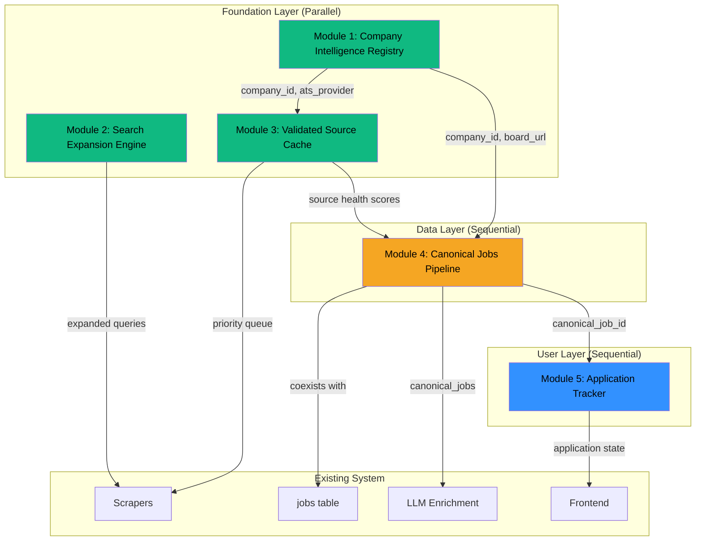

# JobRadar Phase 7A — Core Architecture Package

**Version:** 1.0 | **Date:** March 10, 2026  
**Scope:** Implementation-grade architecture for 5 modules enabling parallel agent development

---

## 0. Executive Summary

This document provides the complete architectural blueprint for JobRadar Phase 7A: five interconnected modules that transform the system from a basic job aggregator into a production-grade job intelligence platform. The **Company Intelligence Registry** (Module 1) and **Validated Source Cache** (Module 3) form the foundation layer—establishing trusted company identities and source health tracking that feed all downstream components. The **Search Expansion Engine** (Module 2) operates independently and can be built in parallel. The **Canonical Jobs Pipeline** (Module 4) depends on Modules 1 and 3 to create a proper two-tier data model separating raw scraped data from canonical job records. Finally, the **Application Tracker** (Module 5) decouples user workflow state from job data, enabling durable application tracking even when source jobs disappear. The implementation order is critical: Modules 1, 2, and 3 can proceed in parallel, Module 4 follows, and Module 5 completes the chain—this sequencing minimizes rework and enables safe, additive migrations without breaking the existing system.

---

## 1. Dependency Graph



### Parallel vs Sequential Breakdown

| Module | Can Build In Parallel With | Must Wait For | Breaks If Skipped |
|--------|---------------------------|---------------|-------------------|
| **M1: Company Registry** | M2, M3 | Nothing | M3 loses company context, M4 cannot resolve company identity |
| **M2: Search Expansion** | M1, M3 | Nothing | Scrapers continue with fixed queries (degraded but functional) |
| **M3: Source Cache** | M1, M2 | Nothing (but benefits from M1) | Scrapers run blind, no health-based prioritization |
| **M4: Canonical Pipeline** | Nothing | M1, M3 | Raw/canonical separation impossible, dedup remains fragile |
| **M5: Application Tracker** | Nothing | M4 (or graceful degradation to job_id) | User state mixed with job data, scraper updates overwrite user edits |

### What Breaks If Reordered

- **Skip M1, build M4 first:** Cannot establish canonical company identity; merge rules have no authoritative source
- **Skip M3, build M4 first:** No source reliability scores; cannot weight provenance in merge decisions
- **Build M5 before M4:** Must link to raw `job_id` instead of `canonical_job_id`; requires migration later when M4 ships
- **Build M2 last:** No impact on other modules, but delays query optimization benefits

---

## 2. Module Deep Sections

---

## 2.1 Module 1: Company Intelligence Registry

### 2.1.1 Problem Definition

**Product Problem:** Scrapers currently guess ATS slugs based on company names and hardcoded watchlists. When a company rebrands, changes ATS providers, or has multiple subsidiaries with separate job boards, the system either misses jobs or creates duplicates.

**Engineering Problem:** No canonical company identity exists. The same company appears as "Stripe", "Stripe, Inc.", "stripe" with different `company_domain` values across sources. Deduplication relies on fuzzy matching rather than a trusted registry.

**Why It Matters Now:** As job volume scales, identity fragmentation compounds. Every new scraper source multiplies the problem. The Canonical Jobs Pipeline (Module 4) cannot merge records without knowing "Stripe on Greenhouse" and "Stripe on Google Jobs" refer to the same entity.

**What Breaks If Skipped:**
- Module 3 cannot associate source URLs with companies
- Module 4 cannot establish canonical company identity for merges
- Deduplication remains O(n²) fuzzy matching instead of O(1) registry lookup
- ATS board discovery remains manual

**Dependencies:** None (foundation module)

### 2.1.2 Scope Boundaries

**V1 In Scope:**
- Company table with canonical name, domain, and ATS metadata
- ATS provider detection via careers page URL pattern matching
- Validation state machine: `unverified` → `probing` → `verified` → `stale` → `invalid`
- Manual override mechanism that survives automated refresh
- Bulk import from existing `jobs.company_name` distinct values
- CRUD + search + validate API endpoints
- Confidence scoring (0-100) based on signal strength

**Explicitly Out of Scope:**
- Subsidiary/parent company hierarchies (V2)
- Company enrichment from Crunchbase/PitchBook (V2)
- Automated domain discovery from company name (V2—requires commercial API)
- Company news/funding alerts (V3)
- Org chart inference (V3)

**V2/V3 Future Items:**
- V2: Subsidiary linking, automated domain resolution, company size/funding data
- V3: Company health scoring, layoff detection, Glassdoor rating integration

### 2.1.3 Domain Model and Schema Design

#### New Tables

**Table: `companies`**

| Column | Type | Constraints | Description |
|--------|------|-------------|-------------|
| `company_id` | TEXT(64) | PK | SHA256(normalized_domain OR normalized_name)[:64] |
| `canonical_name` | TEXT(255) | NOT NULL, UNIQUE | Display name (e.g., "Stripe") |
| `domain` | TEXT(255) | UNIQUE | Primary domain (e.g., "stripe.com") |
| `domain_aliases` | JSON | | Alternative domains: ["stripe.dev", "stripe.network"] |
| `ats_provider` | TEXT(32) | | greenhouse\|lever\|ashby\|workday\|icims\|taleo\|custom\|unknown |
| `ats_slug` | TEXT(128) | | Board identifier (e.g., "stripe" for Greenhouse) |
| `careers_url` | TEXT(512) | | Canonical careers page URL |
| `board_urls` | JSON | | All discovered board URLs |
| `logo_url` | TEXT(512) | | Clearbit or direct logo URL |
| `validation_state` | TEXT(16) | NOT NULL DEFAULT 'unverified' | State machine value |
| `confidence_score` | INTEGER | DEFAULT 0 | 0-100 based on signal strength |
| `last_validated_at` | DATETIME | | Last successful probe |
| `last_probe_at` | DATETIME | | Last probe attempt (success or fail) |
| `probe_error` | TEXT | | Last probe error message |
| `manual_override` | BOOLEAN | DEFAULT FALSE | If TRUE, skip automated refresh |
| `override_fields` | JSON | | Which fields are manually locked |
| `created_at` | DATETIME | NOT NULL DEFAULT CURRENT_TIMESTAMP | |
| `updated_at` | DATETIME | | |

**Indexes:**
- `idx_companies_domain` ON (domain)
- `idx_companies_canonical_name` ON (canonical_name)
- `idx_companies_ats_provider_slug` ON (ats_provider, ats_slug)
- `idx_companies_validation_state` ON (validation_state, last_validated_at)

**Table: `company_sources`**

| Column | Type | Constraints | Description |
|--------|------|-------------|-------------|
| `id` | INTEGER | PK AUTOINCREMENT | |
| `company_id` | TEXT(64) | FK → companies.company_id | |
| `source` | TEXT(32) | NOT NULL | serpapi\|greenhouse\|lever\|ashby\|jobspy\|theirstack |
| `source_identifier` | TEXT(255) | | Source-specific ID |
| `source_url` | TEXT(512) | | Direct board/jobs URL |
| `jobs_count` | INTEGER | DEFAULT 0 | Jobs found from this source |
| `last_seen_at` | DATETIME | | |
| `first_seen_at` | DATETIME | NOT NULL | |

**Indexes:**
- `idx_company_sources_company_id` ON (company_id)
- `idx_company_sources_source` ON (source, source_identifier)

**Table: `ats_detection_log`**

| Column | Type | Constraints | Description |
|--------|------|-------------|-------------|
| `id` | INTEGER | PK AUTOINCREMENT | |
| `company_id` | TEXT(64) | FK → companies.company_id | |
| `probe_url` | TEXT(512) | NOT NULL | URL that was probed |
| `detected_provider` | TEXT(32) | | Detected ATS or NULL |
| `detection_method` | TEXT(32) | | url_pattern\|meta_tag\|api_probe\|redirect |
| `confidence` | INTEGER | | Detection confidence 0-100 |
| `probe_status` | INTEGER | | HTTP status code |
| `probe_duration_ms` | INTEGER | | Probe latency |
| `probed_at` | DATETIME | NOT NULL | |
| `error_message` | TEXT | | If probe failed |

**Indexes:**
- `idx_ats_detection_log_company_id` ON (company_id, probed_at DESC)

#### State Machine: `validation_state`

```
                    ┌─────────────┐
                    │  unverified │ ← Initial state
                    └──────┬──────┘
                           │ trigger: probe_company()
                           ▼
                    ┌─────────────┐
              ┌─────│   probing   │─────┐
              │     └─────────────┘     │
              │                         │
      success │                         │ failure
              ▼                         ▼
       ┌─────────────┐           ┌─────────────┐
       │  verified   │           │   invalid   │
       └──────┬──────┘           └──────┬──────┘
              │                         │
              │ age > 30 days           │ retry after 7 days
              ▼                         │
       ┌─────────────┐                  │
       │    stale    │──────────────────┘
       └─────────────┘    re-probe
```

#### Confidence Scoring Model

| Signal | Points | Max |
|--------|--------|-----|
| Domain verified (DNS resolves) | +20 | 20 |
| Careers page returns 200 | +15 | 15 |
| ATS pattern matched in URL | +25 | 25 |
| ATS API responds with jobs | +30 | 30 |
| Multiple sources confirm same ATS | +10 per source | 30 |
| Jobs scraped successfully | +5 | 5 |
| **Total** | | **100** |

#### Example Records

**companies:**
```json
{
  "company_id": "a1b2c3d4e5f6...",
  "canonical_name": "Stripe",
  "domain": "stripe.com",
  "domain_aliases": ["stripe.dev"],
  "ats_provider": "greenhouse",
  "ats_slug": "stripe",
  "careers_url": "https://stripe.com/jobs",
  "board_urls": ["https://boards.greenhouse.io/stripe"],
  "validation_state": "verified",
  "confidence_score": 95,
  "manual_override": false
}
```

**company_sources:**
```json
{
  "id": 1,
  "company_id": "a1b2c3d4e5f6...",
  "source": "greenhouse",
  "source_identifier": "stripe",
  "source_url": "https://boards.greenhouse.io/stripe",
  "jobs_count": 127,
  "last_seen_at": "2026-03-10T14:00:00Z"
}
```

#### Migration Strategy

1. **Create tables:** `companies`, `company_sources`, `ats_detection_log` (additive)
2. **Seed from jobs:** `INSERT INTO companies SELECT DISTINCT company_name, company_domain FROM jobs`
3. **Add FK to jobs:** `ALTER TABLE jobs ADD COLUMN company_id TEXT REFERENCES companies(company_id)` (nullable initially)
4. **Backfill FK:** Update `jobs.company_id` from domain/name match
5. **Coexistence:** Both `company_name` string and `company_id` FK exist; new code uses FK, old code continues with string

#### Relationship to Current jobs Table

- `jobs.company_name` remains for display (no schema break)
- `jobs.company_id` added as nullable FK
- Scrapers populate both: lookup/create company, then set FK
- Frontend can JOIN for enriched company data

### 2.1.4 API and Interface Design

#### Endpoints

**GET /api/companies**
```
Params: ?q=&ats_provider=&validation_state=&page=1&limit=50
Response: {
  "companies": [...],
  "total": 1234,
  "page": 1,
  "pages": 25
}
```

**GET /api/companies/{company_id}**
```
Response: {
  "company_id": "...",
  "canonical_name": "Stripe",
  "domain": "stripe.com",
  "ats_provider": "greenhouse",
  "ats_slug": "stripe",
  "sources": [...],
  "recent_probes": [...],
  "jobs_count": 127
}
```

**POST /api/companies**
```
Body: {
  "canonical_name": "Acme Corp",
  "domain": "acme.com",
  "ats_provider": "lever",  // optional
  "ats_slug": "acme"        // optional
}
Response: { "company_id": "...", "validation_state": "unverified" }
```

**PATCH /api/companies/{company_id}**
```
Body: {
  "ats_provider": "greenhouse",
  "ats_slug": "acme",
  "manual_override": true,
  "override_fields": ["ats_provider", "ats_slug"]
}
Response: { "company_id": "...", "updated": true }
```

**POST /api/companies/{company_id}/validate**
```
Body: {}  // trigger async validation
Response: { "probe_id": "...", "status": "probing" }
```

**POST /api/companies/bulk-import**
```
Body: {
  "companies": [
    {"canonical_name": "...", "domain": "..."},
    ...
  ]
}
Response: { "imported": 45, "skipped": 3, "errors": [...] }
```

#### Error Contracts

```json
{
  "error": "COMPANY_NOT_FOUND",
  "message": "Company with ID 'xyz' does not exist",
  "detail": { "company_id": "xyz" }
}
```

| Error Code | HTTP Status | Description |
|------------|-------------|-------------|
| COMPANY_NOT_FOUND | 404 | Company ID does not exist |
| DUPLICATE_DOMAIN | 409 | Domain already registered |
| VALIDATION_IN_PROGRESS | 409 | Probe already running |
| INVALID_ATS_PROVIDER | 400 | Unknown ATS provider value |

#### Idempotency

- POST /api/companies: Idempotent on domain—returns existing if domain matches
- POST /api/companies/{id}/validate: Idempotent within 5-minute window
- PATCH: Last-write-wins (no versioning in V1)

#### Example Request/Response

**Request:** POST /api/companies
```json
{
  "canonical_name": "OpenAI",
  "domain": "openai.com"
}
```

**Response:** 201 Created
```json
{
  "company_id": "7f8a9b0c1d2e...",
  "canonical_name": "OpenAI",
  "domain": "openai.com",
  "ats_provider": null,
  "ats_slug": null,
  "validation_state": "unverified",
  "confidence_score": 0,
  "created_at": "2026-03-10T15:30:00Z"
}
```

### 2.1.5 System Design

#### Position in Architecture

```
┌─────────────────────────────────────────────────────────────────┐
│                        API Layer                                 │
│  POST /companies  GET /companies  POST /companies/{id}/validate │
└─────────────────────────────┬───────────────────────────────────┘
                              │
                              ▼
┌─────────────────────────────────────────────────────────────────┐
│                   Company Service                                │
│  - CRUD operations                                               │
│  - Validation orchestration                                      │
│  - Confidence scoring                                            │
└─────────────────────────────┬───────────────────────────────────┘
                              │
              ┌───────────────┼───────────────┐
              ▼               ▼               ▼
┌─────────────────┐ ┌─────────────────┐ ┌─────────────────┐
│  ATS Detector   │ │  Domain Prober  │ │   Logo Fetcher  │
│  (url patterns) │ │  (HEAD/GET)     │ │  (Clearbit)     │
└─────────────────┘ └─────────────────┘ └─────────────────┘
                              │
                              ▼
┌─────────────────────────────────────────────────────────────────┐
│                      SQLite (companies, company_sources)         │
└─────────────────────────────────────────────────────────────────┘
```

#### Data Flow

1. **Ingest:** Company created via API or discovered during scraping
2. **Detect:** ATS detector analyzes careers_url patterns
3. **Probe:** Domain prober validates careers page responds
4. **Score:** Confidence calculated from all signals
5. **Store:** Update company record with findings
6. **Refresh:** APScheduler re-probes stale companies daily

#### Batch vs Real-Time

| Operation | Mode | Rationale |
|-----------|------|-----------|
| Company CRUD | Real-time | Low volume, user-facing |
| ATS detection | Real-time | Fast pattern matching |
| Domain probing | Batched (async) | Network I/O, rate limiting |
| Bulk import | Background job | Large datasets |
| Stale refresh | Scheduled (daily) | Non-urgent |

#### Scheduling Strategy (APScheduler)

```python
scheduler.add_job(
    refresh_stale_companies,
    'cron',
    hour=3,  # 3 AM daily
    id='company_refresh',
    replace_existing=True
)
```

- Batch size: 50 companies per run
- Concurrency: 5 parallel probes
- Backoff: Skip company for 7 days after 3 consecutive failures

#### Caching Strategy

- In-memory LRU cache for `company_id → company` lookup (1000 entries, 5-min TTL)
- No Redis—use Python `functools.lru_cache` or `cachetools.TTLCache`

#### Failure Isolation

- Probe failures don't block company creation
- Network timeouts logged but don't crash service
- Invalid ATS detection recorded, company stays `unverified`

#### Runtime Estimates

| Metric | Estimate |
|--------|----------|
| Write frequency | ~10-50 companies/day (new discoveries) |
| Row growth | ~500 companies after 30 days |
| SQLite contention | LOW—writes are infrequent |
| Probe duration | 500ms-2s per company |
| Daily refresh batch | ~5 minutes for 500 companies |

---

## 2.2 Module 2: Search Expansion Engine

### 2.2.1 Problem Definition

**Product Problem:** Users enter "ML Engineer" but miss jobs titled "Machine Learning Engineer", "Applied Scientist", "AI Engineer", or "Senior ML Research Engineer". The system uses fixed queries, missing 40-60% of relevant postings.

**Engineering Problem:** No query expansion layer exists. Each scraper receives raw user queries. There's no normalization, no synonym expansion, no source-specific query adaptation.

**Why It Matters Now:** As the Company Intelligence Registry identifies more ATS boards, the number of searchable endpoints grows. Without smart query expansion, more endpoints just means more redundant or missed queries.

**What Breaks If Skipped:**
- Scrapers continue with fixed queries (functional but suboptimal)
- No recall/precision measurement
- Users manually maintain query lists
- No foundation for future semantic search improvements

**Dependencies:** None (operates independently, feeds scrapers)

### 2.2.2 Scope Boundaries

**V1 In Scope:**
- Query AST schema (AND/OR trees)
- Deterministic rule-based expansion (synonyms, seniority variants)
- Source-specific query translation (Google Jobs vs Greenhouse)
- Query deduplication (suppress redundant expansions)
- Query preview API (show expanded queries before running)
- Performance tracking per query

**Explicitly Out of Scope:**
- Embedding-driven semantic expansion (V2)
- Query learning from click-through (V2)
- Natural language query parsing (V2)
- Auto-tuning based on result quality (V3)

**V2/V3 Future Items:**
- V2: Semantic expansion via embeddings, A/B testing framework
- V3: Reinforcement learning for query optimization

### 2.2.3 Domain Model and Schema Design

#### New Tables

**Table: `query_templates`**

| Column | Type | Constraints | Description |
|--------|------|-------------|-------------|
| `template_id` | TEXT(64) | PK | SHA256(normalized_intent)[:64] |
| `intent` | TEXT(255) | NOT NULL UNIQUE | User's original intent (e.g., "ML Engineer") |
| `expansion_ast` | JSON | NOT NULL | Query AST (see schema below) |
| `source_translations` | JSON | | Per-source query strings |
| `strictness` | TEXT(16) | DEFAULT 'balanced' | strict\|balanced\|broad |
| `is_active` | BOOLEAN | DEFAULT TRUE | |
| `created_at` | DATETIME | NOT NULL | |
| `updated_at` | DATETIME | | |

**Table: `expansion_rules`**

| Column | Type | Constraints | Description |
|--------|------|-------------|-------------|
| `rule_id` | INTEGER | PK AUTOINCREMENT | |
| `rule_type` | TEXT(32) | NOT NULL | synonym\|seniority\|skill\|boolean |
| `input_pattern` | TEXT(255) | NOT NULL | Regex or exact match |
| `output_variants` | JSON | NOT NULL | List of expansions |
| `priority` | INTEGER | DEFAULT 100 | Lower = higher priority |
| `is_active` | BOOLEAN | DEFAULT TRUE | |

**Table: `query_performance`**

| Column | Type | Constraints | Description |
|--------|------|-------------|-------------|
| `id` | INTEGER | PK AUTOINCREMENT | |
| `template_id` | TEXT(64) | FK → query_templates | |
| `source` | TEXT(32) | NOT NULL | |
| `query_string` | TEXT(512) | NOT NULL | Actual query sent |
| `results_count` | INTEGER | | Jobs returned |
| `new_jobs_count` | INTEGER | | Net new jobs |
| `executed_at` | DATETIME | NOT NULL | |
| `duration_ms` | INTEGER | | |

**Indexes:**
- `idx_query_performance_template_source` ON (template_id, source, executed_at DESC)

#### Query AST Schema

```json
{
  "$schema": "query_ast_v1",
  "type": "OR",
  "children": [
    {
      "type": "AND",
      "children": [
        { "type": "term", "value": "Machine Learning Engineer" },
        { "type": "term", "value": "Python", "optional": true }
      ]
    },
    {
      "type": "term",
      "value": "ML Engineer"
    },
    {
      "type": "term",
      "value": "Applied Scientist"
    }
  ],
  "seniority_variants": ["", "Senior", "Staff", "Principal"],
  "exclude": ["intern", "internship"]
}
```

#### Source-Specific Translation Rules

| Source | Query Format | Example |
|--------|--------------|---------|
| SerpApi (Google Jobs) | Natural language | "Senior Machine Learning Engineer Python" |
| Greenhouse | Title filter | `/jobs?title=Machine+Learning` |
| Lever | Path includes company | Natural language search |
| JobSpy | `search_term` param | "ML Engineer OR Machine Learning Engineer" |

#### Example Records

**query_templates:**
```json
{
  "template_id": "abc123...",
  "intent": "ML Engineer",
  "expansion_ast": {
    "type": "OR",
    "children": [
      {"type": "term", "value": "Machine Learning Engineer"},
      {"type": "term", "value": "ML Engineer"},
      {"type": "term", "value": "Applied Scientist"},
      {"type": "term", "value": "AI Engineer"}
    ],
    "seniority_variants": ["", "Senior", "Staff"]
  },
  "source_translations": {
    "serpapi": "\"Machine Learning Engineer\" OR \"ML Engineer\" OR \"Applied Scientist\"",
    "jobspy": "Machine Learning Engineer"
  },
  "strictness": "balanced"
}
```

**expansion_rules:**
```json
{
  "rule_id": 1,
  "rule_type": "synonym",
  "input_pattern": "ML Engineer",
  "output_variants": ["Machine Learning Engineer", "Applied Scientist", "AI Engineer"],
  "priority": 10
}
```

#### Migration Strategy

1. **Create tables:** All new tables (no existing data to migrate)
2. **Seed rules:** Insert default expansion rules from predefined list
3. **Bootstrap templates:** Create templates from `user_profile.default_queries`

### 2.2.4 API and Interface Design

#### Endpoints

**POST /api/search/expand**
```
Body: {
  "intent": "ML Engineer",
  "strictness": "balanced",  // strict|balanced|broad
  "sources": ["serpapi", "greenhouse", "jobspy"]
}
Response: {
  "template_id": "abc123...",
  "intent": "ML Engineer",
  "expansion_ast": {...},
  "source_queries": {
    "serpapi": "\"Machine Learning Engineer\" OR \"ML Engineer\"",
    "greenhouse": "Machine Learning",
    "jobspy": "Machine Learning Engineer"
  },
  "estimated_variants": 12
}
```

**GET /api/search/expand/preview**
```
Params: ?intent=ML+Engineer&strictness=balanced
Response: {
  "variants": [
    "ML Engineer",
    "Machine Learning Engineer",
    "Senior ML Engineer",
    "Staff Machine Learning Engineer",
    "Applied Scientist",
    ...
  ],
  "total": 12,
  "suppressed_duplicates": 3
}
```

**POST /api/search/templates**
```
Body: {
  "intent": "Data Scientist",
  "custom_variants": ["Data Science", "Analytics Engineer"],
  "strictness": "broad"
}
Response: { "template_id": "...", "created": true }
```

**GET /api/search/templates**
```
Response: {
  "templates": [
    {"template_id": "...", "intent": "ML Engineer", "is_active": true},
    ...
  ]
}
```

**GET /api/search/performance**
```
Params: ?template_id=&source=&days=30
Response: {
  "performance": [
    {
      "template_id": "...",
      "source": "serpapi",
      "total_queries": 45,
      "avg_results": 127,
      "avg_new_jobs": 23
    },
    ...
  ]
}
```

#### Example Request/Response

**Request:** POST /api/search/expand
```json
{
  "intent": "Backend Engineer",
  "strictness": "balanced",
  "sources": ["serpapi", "greenhouse"]
}
```

**Response:** 200 OK
```json
{
  "template_id": "d4e5f6...",
  "intent": "Backend Engineer",
  "expansion_ast": {
    "type": "OR",
    "children": [
      {"type": "term", "value": "Backend Engineer"},
      {"type": "term", "value": "Backend Developer"},
      {"type": "term", "value": "Server Engineer"},
      {"type": "AND", "children": [
        {"type": "term", "value": "Software Engineer"},
        {"type": "term", "value": "Backend"}
      ]}
    ],
    "seniority_variants": ["", "Senior", "Staff"]
  },
  "source_queries": {
    "serpapi": "\"Backend Engineer\" OR \"Backend Developer\" OR \"Server Engineer\"",
    "greenhouse": "Backend Engineer"
  },
  "estimated_variants": 9
}
```

### 2.2.5 System Design

#### Position in Architecture

```
┌─────────────────────────────────────────────────────────────────┐
│                    User / Scraper Scheduler                      │
│                    "I want: ML Engineer jobs"                    │
└─────────────────────────────┬───────────────────────────────────┘
                              │
                              ▼
┌─────────────────────────────────────────────────────────────────┐
│                   Search Expansion Engine                        │
│  ┌──────────────┐  ┌──────────────┐  ┌──────────────────────┐   │
│  │ Rule Engine  │→│ AST Builder  │→│ Source Translator    │   │
│  │ (synonyms)   │  │ (AND/OR)     │  │ (per-source format)  │   │
│  └──────────────┘  └──────────────┘  └──────────────────────┘   │
└─────────────────────────────┬───────────────────────────────────┘
                              │
                              ▼
              ┌───────────────┴───────────────┐
              │                               │
              ▼                               ▼
┌─────────────────────────┐     ┌─────────────────────────┐
│  SerpApi Scraper        │     │  Greenhouse Scraper     │
│  query: "ML Engineer    │     │  query: Machine         │
│    OR Applied Scientist"│     │    Learning             │
└─────────────────────────┘     └─────────────────────────┘
```

#### Data Flow

1. **Input:** User intent string + strictness level
2. **Normalize:** Lowercase, trim, remove punctuation
3. **Match Rules:** Apply expansion_rules in priority order
4. **Build AST:** Construct AND/OR tree with variants
5. **Apply Seniority:** Generate seniority prefixes
6. **Dedupe:** Remove equivalent variants
7. **Translate:** Convert AST to source-specific strings
8. **Output:** Source-query map + AST for logging

#### Batch vs Real-Time

| Operation | Mode | Rationale |
|-----------|------|-----------|
| Query expansion | Real-time | <10ms per expansion |
| Template CRUD | Real-time | Low volume |
| Performance aggregation | Batched (hourly) | Analytics only |

#### Caching Strategy

- Cache `intent → template` for 1 hour (most users reuse intents)
- Cache `expansion_rules` in memory on startup (reload on update)

#### Runtime Estimates

| Metric | Estimate |
|--------|----------|
| Expansion latency | <10ms |
| Templates created | ~20-50 per user |
| Performance rows | ~100-200/day |
| SQLite contention | MINIMAL |

---

## 2.3 Module 3: Validated Source Cache

### 2.3.1 Problem Definition

**Product Problem:** Scrapers hit dead URLs, broken ATS endpoints, and rate-limited sources without knowing which are reliable. Time is wasted on sources that consistently fail.

**Engineering Problem:** No source health tracking exists. Every scraper run starts fresh with no memory of previous failures. Exponential backoff is per-run, not persistent.

**Why It Matters Now:** As Module 1 discovers more company boards, the source count multiplies. Without health tracking, scraper scheduler wastes cycles on dead endpoints.

**What Breaks If Skipped:**
- Module 4 cannot weight source reliability in merge decisions
- Scraper scheduler runs blind
- No data for debugging source issues
- Rate limit violations accumulate

**Dependencies:** Benefits from Module 1 (company context) but can operate standalone

### 2.3.2 Scope Boundaries

**V1 In Scope:**
- Source registry with URL, type, and health state
- Health state machine: `healthy` → `degraded` → `failing` → `dead`
- Exponential backoff with persistent state
- Freshness tracking (last success, age)
- Source quality scoring (success rate, job yield)
- Manual override (force enable/disable)
- APScheduler integration for priority queue
- robots.txt compliance flag

**Explicitly Out of Scope:**
- Automatic rate limit detection (V2)
- Geographic load balancing (V2)
- Source cost tracking (V3)

### 2.3.3 Domain Model and Schema Design

#### New Tables

**Table: `source_registry`**

| Column | Type | Constraints | Description |
|--------|------|-------------|-------------|
| `source_id` | TEXT(64) | PK | SHA256(source_type:url)[:64] |
| `source_type` | TEXT(32) | NOT NULL | serpapi\|greenhouse\|lever\|ashby\|jobspy\|theirstack\|apify |
| `url` | TEXT(512) | NOT NULL | Base URL or endpoint |
| `company_id` | TEXT(64) | FK → companies | Optional link to company |
| `health_state` | TEXT(16) | NOT NULL DEFAULT 'unknown' | healthy\|degraded\|failing\|dead\|unknown |
| `quality_score` | INTEGER | DEFAULT 50 | 0-100, higher = better |
| `success_count` | INTEGER | DEFAULT 0 | Lifetime successes |
| `failure_count` | INTEGER | DEFAULT 0 | Lifetime failures |
| `consecutive_failures` | INTEGER | DEFAULT 0 | Resets on success |
| `last_success_at` | DATETIME | | |
| `last_failure_at` | DATETIME | | |
| `last_check_at` | DATETIME | | |
| `next_check_at` | DATETIME | | When to retry |
| `backoff_until` | DATETIME | | Don't retry before this |
| `avg_job_yield` | REAL | | Average jobs per successful scrape |
| `avg_response_time_ms` | INTEGER | | Average latency |
| `robots_compliant` | BOOLEAN | DEFAULT TRUE | |
| `rate_limit_hits` | INTEGER | DEFAULT 0 | 429 responses |
| `manual_enabled` | BOOLEAN | | NULL = auto, TRUE/FALSE = override |
| `created_at` | DATETIME | NOT NULL | |
| `updated_at` | DATETIME | | |

**Indexes:**
- `idx_source_registry_type` ON (source_type)
- `idx_source_registry_health` ON (health_state, next_check_at)
- `idx_source_registry_company` ON (company_id)

**Table: `source_check_log`**

| Column | Type | Constraints | Description |
|--------|------|-------------|-------------|
| `id` | INTEGER | PK AUTOINCREMENT | |
| `source_id` | TEXT(64) | FK → source_registry | |
| `check_type` | TEXT(16) | NOT NULL | scrape\|probe\|health |
| `status` | TEXT(16) | NOT NULL | success\|failure\|timeout\|rate_limited |
| `http_status` | INTEGER | | |
| `jobs_found` | INTEGER | | |
| `duration_ms` | INTEGER | | |
| `error_message` | TEXT | | |
| `checked_at` | DATETIME | NOT NULL | |

**Indexes:**
- `idx_source_check_log_source_time` ON (source_id, checked_at DESC)

#### State Machine: `health_state`

```
                    ┌─────────────┐
                    │   unknown   │ ← Initial
                    └──────┬──────┘
                           │ first check
              ┌────────────┴────────────┐
              │                         │
          success                    failure
              │                         │
              ▼                         ▼
       ┌─────────────┐           ┌─────────────┐
       │   healthy   │──────────▶│  degraded   │
       └──────┬──────┘  3 fails  └──────┬──────┘
              │                         │
              │                    5 more fails
              │                         │
              │                         ▼
              │                  ┌─────────────┐
              │                  │   failing   │
              │                  └──────┬──────┘
              │                         │
              │                   10 more fails
              │                         │
              │                         ▼
              │                  ┌─────────────┐
              └──────────────────│    dead     │
                   1 success     └─────────────┘
```

#### Backoff Policy

| Consecutive Failures | Backoff Duration |
|---------------------|------------------|
| 1-2 | 5 minutes |
| 3-4 | 30 minutes |
| 5-9 | 2 hours |
| 10-19 | 12 hours |
| 20+ | 7 days |

Formula: `min(7 days, 5 min × 2^(failures-1))`

#### Quality Scoring Formula

```python
quality_score = (
    (success_rate * 40) +           # 0-40 points
    (freshness_score * 30) +        # 0-30 points
    (yield_score * 20) +            # 0-20 points
    (latency_score * 10)            # 0-10 points
)

# Where:
success_rate = success_count / (success_count + failure_count)
freshness_score = max(0, 1 - (hours_since_success / 168))  # 7-day window
yield_score = min(1, avg_job_yield / 50)  # Cap at 50 jobs
latency_score = max(0, 1 - (avg_response_time_ms / 5000))  # 5s cap
```

#### Example Records

**source_registry:**
```json
{
  "source_id": "gh_stripe_abc...",
  "source_type": "greenhouse",
  "url": "https://boards-api.greenhouse.io/v1/boards/stripe/jobs",
  "company_id": "stripe_123...",
  "health_state": "healthy",
  "quality_score": 87,
  "success_count": 145,
  "failure_count": 3,
  "consecutive_failures": 0,
  "last_success_at": "2026-03-10T12:00:00Z",
  "avg_job_yield": 127.5,
  "avg_response_time_ms": 450
}
```

### 2.3.4 API and Interface Design

#### Endpoints

**GET /api/sources**
```
Params: ?source_type=&health_state=&company_id=&page=1&limit=50
Response: {
  "sources": [...],
  "total": 234,
  "by_health": {"healthy": 180, "degraded": 30, "failing": 20, "dead": 4}
}
```

**GET /api/sources/{source_id}**
```
Response: {
  "source_id": "...",
  "url": "...",
  "health_state": "healthy",
  "quality_score": 87,
  "recent_checks": [...],
  "stats": {
    "success_rate": 0.98,
    "avg_yield": 127,
    "avg_latency_ms": 450
  }
}
```

**POST /api/sources/{source_id}/check**
```
Body: {}  // Trigger immediate health check
Response: { "check_id": "...", "status": "queued" }
```

**PATCH /api/sources/{source_id}**
```
Body: {
  "manual_enabled": true  // Force enable/disable
}
Response: { "source_id": "...", "updated": true }
```

**GET /api/sources/priority-queue**
```
Response: {
  "queue": [
    {"source_id": "...", "source_type": "greenhouse", "priority": 95, "next_check_at": "..."},
    ...
  ]
}
```

**POST /api/sources/record-check**
```
Body: {
  "source_id": "...",
  "status": "success",
  "jobs_found": 45,
  "duration_ms": 380
}
Response: { "recorded": true, "new_health_state": "healthy" }
```

#### SSE Events (for Scraper Log)

```
event: source_health_change
data: {"source_id": "...", "old_state": "healthy", "new_state": "degraded"}

event: source_check_complete
data: {"source_id": "...", "status": "success", "jobs_found": 45}
```

### 2.3.5 System Design

#### Position in Architecture

```
┌─────────────────────────────────────────────────────────────────┐
│                    APScheduler                                   │
│            "What sources should I scrape next?"                  │
└─────────────────────────────┬───────────────────────────────────┘
                              │
                              ▼
┌─────────────────────────────────────────────────────────────────┐
│                  Validated Source Cache                          │
│  ┌──────────────┐  ┌──────────────┐  ┌──────────────────────┐   │
│  │ Priority     │  │ Health       │  │ Backoff              │   │
│  │ Calculator   │  │ State Machine│  │ Manager              │   │
│  └──────────────┘  └──────────────┘  └──────────────────────┘   │
└─────────────────────────────┬───────────────────────────────────┘
                              │
                              ▼
┌─────────────────────────────────────────────────────────────────┐
│                      Scrapers                                    │
│  (Record success/failure back to Source Cache)                   │
└─────────────────────────────────────────────────────────────────┘
```

#### Scheduler Integration

```python
# In scheduler.py, modify scraper job to consult source cache
async def run_scraper_with_priority(source_type: str):
    sources = await get_priority_queue(source_type, limit=10)
    for source in sources:
        if source.backoff_until and source.backoff_until > datetime.utcnow():
            continue  # Skip sources in backoff
        try:
            jobs = await scraper.fetch_jobs(source.url)
            await record_check(source.source_id, 'success', len(jobs))
        except Exception as e:
            await record_check(source.source_id, 'failure', error=str(e))
```

#### Write Batching Strategy

To avoid SQLite write amplification:
1. Buffer check results in memory (max 100 or 60 seconds)
2. Batch INSERT into `source_check_log`
3. Batch UPDATE `source_registry` health states
4. Use single transaction for batch

#### Runtime Estimates

| Metric | Estimate |
|--------|----------|
| Source count | 200-500 (company boards + aggregators) |
| Check frequency | ~10-20 checks/hour |
| Log row growth | ~500 rows/day |
| SQLite contention | LOW with batching |

---

## 2.4 Module 4: Canonical Jobs Pipeline

### 2.4.1 Problem Definition

**Product Problem:** The same job appears on LinkedIn, Greenhouse, and Google Jobs as three separate records. Users see duplicates; analytics are inflated; tracking is fragmented.

**Engineering Problem:** The current `jobs` table has one source per job. Deduplication marks `duplicate_of` but doesn't create a true canonical record. No provenance chain exists.

**Why It Matters Now:** Module 5 (Application Tracker) needs a stable job identity. If users apply to a job via Greenhouse but it came from Google Jobs originally, state gets confused.

**What Breaks If Skipped:**
- Module 5 must link to unstable raw job_ids
- Deduplication remains fragile
- No multi-source provenance
- Job closure detection impossible

**Dependencies:** Module 1 (company identity), Module 3 (source quality for merge weighting)

### 2.4.2 Scope Boundaries

**V1 In Scope:**
- Two-tier model: `raw_job_sources` + `canonical_jobs`
- Deterministic `canonical_job_id` generation
- Merge rules with field-level precedence
- Source quality weighting in merges
- Stale/closed job detection
- Coexistence with existing `jobs` table
- Additive migration (no data loss)

**Explicitly Out of Scope:**
- Job versioning/history (V2)
- Manual merge/split UI (V2)
- Cross-company job matching (V2)
- Job similarity clustering (V3)

### 2.4.3 Domain Model and Schema Design

#### New Tables

**Table: `raw_job_sources`**

| Column | Type | Constraints | Description |
|--------|------|-------------|-------------|
| `raw_id` | TEXT(64) | PK | SHA256(source:source_job_id)[:64] |
| `canonical_job_id` | TEXT(64) | FK → canonical_jobs | NULL until merged |
| `source` | TEXT(32) | NOT NULL | serpapi\|greenhouse\|lever\|ashby\|jobspy |
| `source_job_id` | TEXT(128) | | Original ID from source |
| `source_url` | TEXT(512) | | Direct link |
| `source_id` | TEXT(64) | FK → source_registry | |
| `raw_payload` | JSON | | Complete raw response |
| `title_raw` | TEXT(500) | | |
| `company_name_raw` | TEXT(255) | | |
| `location_raw` | TEXT(255) | | |
| `salary_raw` | TEXT(128) | | |
| `description_raw` | TEXT | | |
| `first_seen_at` | DATETIME | NOT NULL | |
| `last_seen_at` | DATETIME | NOT NULL | |
| `is_active` | BOOLEAN | DEFAULT TRUE | FALSE if missing from source |
| `scrape_count` | INTEGER | DEFAULT 1 | How many times seen |

**Indexes:**
- `idx_raw_job_sources_canonical` ON (canonical_job_id)
- `idx_raw_job_sources_source` ON (source, source_job_id)
- `idx_raw_job_sources_active` ON (is_active, last_seen_at)

**Table: `canonical_jobs`**

| Column | Type | Constraints | Description |
|--------|------|-------------|-------------|
| `canonical_job_id` | TEXT(64) | PK | Deterministic hash |
| `company_id` | TEXT(64) | FK → companies | |
| `company_name` | TEXT(255) | NOT NULL | Canonical display name |
| `title` | TEXT(500) | NOT NULL | Normalized title |
| `title_normalized` | TEXT(500) | | Lowercase, stripped |
| `location_city` | TEXT(128) | | |
| `location_state` | TEXT(64) | | |
| `location_country` | TEXT(64) | | |
| `location_raw` | TEXT(255) | | Combined string |
| `remote_type` | TEXT(16) | | remote\|hybrid\|onsite\|unknown |
| `job_type` | TEXT(32) | | full-time\|part-time\|contract\|internship |
| `experience_level` | TEXT(16) | | entry\|mid\|senior\|exec |
| `salary_min` | INTEGER | | Normalized to annual USD |
| `salary_max` | INTEGER | | |
| `salary_currency` | TEXT(3) | DEFAULT 'USD' | |
| `description_markdown` | TEXT | | Cleaned, merged |
| `apply_url` | TEXT(512) | | Best apply link |
| `source_count` | INTEGER | DEFAULT 1 | N sources for this job |
| `primary_source` | TEXT(32) | | Highest quality source |
| `quality_score` | INTEGER | | 0-100 based on data completeness |
| `first_seen_at` | DATETIME | NOT NULL | |
| `last_seen_at` | DATETIME | NOT NULL | |
| `is_active` | BOOLEAN | DEFAULT TRUE | |
| `closed_at` | DATETIME | | When detected as closed |
| `created_at` | DATETIME | NOT NULL | |
| `updated_at` | DATETIME | | |

**Indexes:**
- `idx_canonical_jobs_company` ON (company_id)
- `idx_canonical_jobs_title_norm` ON (title_normalized, company_id)
- `idx_canonical_jobs_active` ON (is_active, last_seen_at)

#### Canonical Job ID Generation

```python
def compute_canonical_job_id(company_id: str, title: str, location: str) -> str:
    """Deterministic canonical ID from company + normalized title + location."""
    normalized_title = normalize_title(title)  # lowercase, strip seniority
    normalized_location = normalize_location(location)  # city or "remote"
    key = f"{company_id}:{normalized_title}:{normalized_location}"
    return hashlib.sha256(key.encode()).hexdigest()[:64]
```

#### Merge Rules and Precedence

| Field | Merge Strategy | Source Preference |
|-------|---------------|-------------------|
| title | Longest non-generic | ATS > Aggregator |
| company_name | From company registry | Registry > raw |
| location | Most specific | ATS > Google Jobs |
| salary | Highest available | ATS (verified) > Aggregator |
| description | Longest/richest | ATS > scraped |
| apply_url | Direct ATS link | ATS > Google Jobs |
| remote_type | Most confident | Explicit > inferred |

**Source Quality Order:** Greenhouse > Lever > Ashby > SerpApi > JobSpy

#### State Machine: Canonical Job Lifecycle

```
┌─────────────┐
│   active    │ ← Most sources report it
└──────┬──────┘
       │
       │ All sources report missing (2+ scrapes)
       ▼
┌─────────────┐
│   stale     │ ← No recent sightings
└──────┬──────┘
       │
       │ 14 days without sighting
       ▼
┌─────────────┐
│   closed    │ ← Presumed filled/removed
└─────────────┘
```

#### Example Records

**raw_job_sources:**
```json
{
  "raw_id": "gh_abc123...",
  "canonical_job_id": "canon_xyz789...",
  "source": "greenhouse",
  "source_job_id": "4567890",
  "source_url": "https://boards.greenhouse.io/stripe/jobs/4567890",
  "title_raw": "Senior Machine Learning Engineer",
  "company_name_raw": "Stripe",
  "first_seen_at": "2026-03-01T10:00:00Z",
  "last_seen_at": "2026-03-10T14:00:00Z",
  "is_active": true,
  "scrape_count": 15
}
```

**canonical_jobs:**
```json
{
  "canonical_job_id": "canon_xyz789...",
  "company_id": "stripe_123...",
  "company_name": "Stripe",
  "title": "Senior Machine Learning Engineer",
  "location_city": "San Francisco",
  "remote_type": "hybrid",
  "salary_min": 180000,
  "salary_max": 250000,
  "source_count": 3,
  "primary_source": "greenhouse",
  "quality_score": 92,
  "is_active": true
}
```

#### Migration Strategy

1. **Create tables:** `raw_job_sources`, `canonical_jobs` (new)
2. **No immediate migration:** Existing `jobs` table continues working
3. **Dual-write period:** Scrapers write to both old and new tables
4. **Backfill:** Batch job converts existing `jobs` → `raw_job_sources` + `canonical_jobs`
5. **Add FK:** `jobs.canonical_job_id` nullable FK added
6. **Frontend migration:** Gradual switch from `jobs` to `canonical_jobs`

#### Coexistence Period

- **Duration:** 4-6 weeks
- **Old path:** `jobs` table for all reads/writes (existing code)
- **New path:** `canonical_jobs` for new features (Application Tracker)
- **Sync:** Background job keeps `jobs.canonical_job_id` updated
- **No breaking changes:** Frontend continues using `/api/jobs` endpoint

### 2.4.4 API and Interface Design

#### Endpoints

**GET /api/canonical-jobs**
```
Params: ?company_id=&q=&location=&remote_type=&page=1&limit=50
Response: {
  "jobs": [...],
  "total": 5432
}
```

**GET /api/canonical-jobs/{canonical_job_id}**
```
Response: {
  "canonical_job_id": "...",
  "title": "Senior ML Engineer",
  "company": {...},
  "sources": [
    {"source": "greenhouse", "url": "...", "last_seen": "..."},
    {"source": "serpapi", "url": "...", "last_seen": "..."}
  ],
  "quality_score": 92
}
```

**GET /api/canonical-jobs/{id}/sources**
```
Response: {
  "sources": [
    {
      "raw_id": "...",
      "source": "greenhouse",
      "source_url": "...",
      "first_seen_at": "...",
      "last_seen_at": "...",
      "is_active": true
    },
    ...
  ]
}
```

**POST /api/canonical-jobs/merge**
```
Body: {
  "raw_ids": ["raw_1", "raw_2", "raw_3"]
}
Response: {
  "canonical_job_id": "...",
  "merged_count": 3
}
```

**Internal:** POST /api/internal/record-raw-job
```
Body: {
  "source": "greenhouse",
  "source_job_id": "4567890",
  "source_url": "...",
  "raw_payload": {...}
}
Response: {
  "raw_id": "...",
  "canonical_job_id": "...",  // Created or matched
  "is_new_canonical": false
}
```

### 2.4.5 System Design

#### Position in Architecture

```
┌─────────────────────────────────────────────────────────────────┐
│                        Scrapers                                  │
│   (SerpApi, Greenhouse, Lever, Ashby, JobSpy)                   │
└─────────────────────────────┬───────────────────────────────────┘
                              │ raw job data
                              ▼
┌─────────────────────────────────────────────────────────────────┐
│                 Canonical Jobs Pipeline                          │
│  ┌──────────────┐  ┌──────────────┐  ┌──────────────────────┐   │
│  │ Raw Ingester │→│ Matcher      │→│ Merger               │   │
│  │              │  │ (find canon) │  │ (field precedence)   │   │
│  └──────────────┘  └──────────────┘  └──────────────────────┘   │
│                              │                                   │
│                              ▼                                   │
│                    ┌──────────────────┐                         │
│                    │ Stale Detector   │                         │
│                    │ (mark closed)    │                         │
│                    └──────────────────┘                         │
└─────────────────────────────┬───────────────────────────────────┘
                              │
              ┌───────────────┼───────────────┐
              ▼               ▼               ▼
┌─────────────────┐ ┌─────────────────┐ ┌─────────────────┐
│ raw_job_sources │ │ canonical_jobs  │ │ jobs (existing) │
│ (new)           │ │ (new)           │ │ (coexistence)   │
└─────────────────┘ └─────────────────┘ └─────────────────┘
```

#### Pipeline Stages

1. **Ingest:** Scraper calls `record-raw-job` with raw payload
2. **Normalize:** Clean title, location, company name
3. **Company Resolve:** Lookup/create company in registry
4. **Match:** Compute canonical_job_id, check if exists
5. **Merge or Create:** Update existing canonical or create new
6. **Sync Legacy:** Update `jobs` table for backward compatibility
7. **Enrich:** Queue for LLM enrichment if new

#### Scheduling

```python
# Stale detection: daily at 4 AM
scheduler.add_job(
    detect_stale_jobs,
    'cron',
    hour=4,
    id='stale_job_detection',
    replace_existing=True
)
```

#### Runtime Estimates

| Metric | Estimate |
|--------|----------|
| Raw sources per canonical | 1.5-3 average |
| Canonical jobs created/day | 50-200 |
| Raw source records/day | 100-500 |
| Merge operations/day | 50-150 |
| SQLite contention | MODERATE—use transactions |

---

## 2.5 Module 5: Application Tracker

### 2.5.1 Problem Definition

**Product Problem:** User-edited state (notes, status, tags) lives in the `jobs` table alongside scraped data. When scrapers refresh, there's risk of state conflicts. When jobs disappear from sources, user tracking data could be orphaned.

**Engineering Problem:** No separation between system-owned fields (title, salary, description) and user-owned fields (status, notes, applied_at). The kanban reads/writes directly to `jobs`.

**Why It Matters Now:** Module 4 introduces canonical jobs, but user workflow state needs its own table. Future features (auto-apply, reminders) require a dedicated application entity.

**What Breaks If Skipped:**
- User edits mixed with scraper updates
- No application history/audit trail
- Reminders and follow-ups impossible
- Future auto-apply has nowhere to store state

**Dependencies:** Module 4 for `canonical_job_id` (with graceful degradation to `job_id`)

### 2.5.2 Scope Boundaries

**V1 In Scope:**
- `applications` table separate from job data
- Status state machine with timestamps
- Notes, tags, custom fields (JSON)
- Reminders and follow-up dates
- Audit trail for status changes
- Migration from current `jobs.status`
- Link to `canonical_job_id` OR `job_id` (graceful degradation)

**Explicitly Out of Scope:**
- Auto-apply event logging (V2)
- Document attachments (resume versions, cover letters) (V2)
- Multi-stage interview scheduling (V3)
- Calendar integration (V3)

### 2.5.3 Domain Model and Schema Design

#### New Tables

**Table: `applications`**

| Column | Type | Constraints | Description |
|--------|------|-------------|-------------|
| `application_id` | TEXT(64) | PK | UUID or hash |
| `canonical_job_id` | TEXT(64) | FK → canonical_jobs | Nullable if M4 not ready |
| `legacy_job_id` | TEXT(64) | FK → jobs.job_id | Fallback if no canonical |
| `status` | TEXT(32) | NOT NULL DEFAULT 'saved' | Current status |
| `status_changed_at` | DATETIME | | Last status change |
| `notes` | TEXT | | User notes (rich text) |
| `tags` | JSON | | ["dream-job", "referral"] |
| `custom_fields` | JSON | | User-defined key-value |
| `applied_at` | DATETIME | | When applied |
| `applied_via` | TEXT(64) | | manual\|auto\|referral |
| `response_at` | DATETIME | | First response received |
| `interview_at` | DATETIME | | Scheduled interview |
| `offer_at` | DATETIME | | Offer received |
| `rejected_at` | DATETIME | | Rejection received |
| `follow_up_at` | DATETIME | | Next follow-up date |
| `reminder_at` | DATETIME | | Reminder datetime |
| `reminder_note` | TEXT | | Reminder message |
| `is_archived` | BOOLEAN | DEFAULT FALSE | Hidden from active views |
| `created_at` | DATETIME | NOT NULL | |
| `updated_at` | DATETIME | | |

**Indexes:**
- `idx_applications_canonical` ON (canonical_job_id)
- `idx_applications_legacy` ON (legacy_job_id)
- `idx_applications_status` ON (status, is_archived)
- `idx_applications_followup` ON (follow_up_at) WHERE follow_up_at IS NOT NULL
- `idx_applications_reminder` ON (reminder_at) WHERE reminder_at IS NOT NULL

**Table: `application_status_history`**

| Column | Type | Constraints | Description |
|--------|------|-------------|-------------|
| `id` | INTEGER | PK AUTOINCREMENT | |
| `application_id` | TEXT(64) | FK → applications | |
| `old_status` | TEXT(32) | | NULL for creation |
| `new_status` | TEXT(32) | NOT NULL | |
| `changed_at` | DATETIME | NOT NULL | |
| `change_source` | TEXT(16) | | user\|system\|auto |
| `note` | TEXT | | Optional change note |

**Indexes:**
- `idx_status_history_app` ON (application_id, changed_at DESC)

#### Status State Machine

```
┌─────────────┐
│   saved     │ ← User saves job for later
└──────┬──────┘
       │
       ▼
┌─────────────┐
│  applied    │ ← User submits application
└──────┬──────┘
       │
       ├────────────────┬────────────────┐
       ▼                ▼                ▼
┌─────────────┐  ┌─────────────┐  ┌─────────────┐
│phone_screen │  │  rejected   │  │  ghosted    │
└──────┬──────┘  └─────────────┘  └─────────────┘
       │
       ▼
┌─────────────┐
│ interviewing│
└──────┬──────┘
       │
       ├────────────────┬────────────────┐
       ▼                ▼                ▼
┌─────────────┐  ┌─────────────┐  ┌─────────────┐
│ final_round │  │  rejected   │  │  ghosted    │
└──────┬──────┘  └─────────────┘  └─────────────┘
       │
       ├────────────────┬────────────────┐
       ▼                ▼                ▼
┌─────────────┐  ┌─────────────┐  ┌─────────────┐
│   offer     │  │  rejected   │  │ withdrawn   │
└──────┬──────┘  └─────────────┘  └─────────────┘
       │
       ├────────────────┐
       ▼                ▼
┌─────────────┐  ┌─────────────┐
│  accepted   │  │  declined   │
└─────────────┘  └─────────────┘
```

**Valid Status Values:**
`saved`, `applied`, `phone_screen`, `interviewing`, `final_round`, `offer`, `accepted`, `declined`, `rejected`, `ghosted`, `withdrawn`

#### Field Ownership Classification

| Field | Owner | Can Scraper Update? |
|-------|-------|---------------------|
| status | USER | NO |
| notes | USER | NO |
| tags | USER | NO |
| custom_fields | USER | NO |
| applied_at | USER | NO |
| reminder_at | USER | NO |
| canonical_job_id | SYSTEM | YES (link to canonical) |
| created_at | SYSTEM | NO |

#### Example Records

**applications:**
```json
{
  "application_id": "app_abc123...",
  "canonical_job_id": "canon_xyz789...",
  "legacy_job_id": null,
  "status": "interviewing",
  "status_changed_at": "2026-03-08T14:00:00Z",
  "notes": "Great call with hiring manager. Mentioned they're looking for ML Ops experience.",
  "tags": ["dream-job", "referral"],
  "custom_fields": {"referrer": "John Smith", "salary_expectation": 220000},
  "applied_at": "2026-03-01T10:00:00Z",
  "applied_via": "referral",
  "interview_at": "2026-03-12T15:00:00Z",
  "follow_up_at": "2026-03-15T09:00:00Z",
  "is_archived": false
}
```

#### Migration Strategy

1. **Create tables:** `applications`, `application_status_history`
2. **Migrate existing:** For each `jobs` row with status != 'new':
   ```sql
   INSERT INTO applications (canonical_job_id, legacy_job_id, status, notes, tags, applied_at)
   SELECT canonical_job_id, job_id, status, notes, tags, applied_at FROM jobs
   WHERE status != 'new'
   ```
3. **Keep jobs.status:** Don't remove—allows gradual frontend migration
4. **Dual-write period:** API writes to both `jobs.status` and `applications`
5. **Frontend migration:** Switch kanban to read from `applications`

### 2.5.4 API and Interface Design

#### Endpoints

**GET /api/applications**
```
Params: ?status=&tags=&is_archived=false&page=1&limit=50
Response: {
  "applications": [
    {
      "application_id": "...",
      "job": {  // Embedded job summary
        "canonical_job_id": "...",
        "title": "Senior ML Engineer",
        "company_name": "Stripe"
      },
      "status": "interviewing",
      "applied_at": "...",
      "next_action": {"type": "interview", "at": "2026-03-12T15:00:00Z"}
    },
    ...
  ],
  "total": 45,
  "by_status": {"saved": 20, "applied": 15, "interviewing": 8, "offer": 2}
}
```

**GET /api/applications/{application_id}**
```
Response: {
  "application_id": "...",
  "job": {...},  // Full job details
  "status": "interviewing",
  "status_history": [...],
  "notes": "...",
  "tags": [...],
  "custom_fields": {...},
  "timeline": [
    {"event": "saved", "at": "2026-02-28T..."},
    {"event": "applied", "at": "2026-03-01T..."},
    {"event": "phone_screen", "at": "2026-03-05T..."},
    {"event": "interviewing", "at": "2026-03-08T..."}
  ]
}
```

**POST /api/applications**
```
Body: {
  "canonical_job_id": "...",  // OR legacy_job_id
  "status": "saved",
  "notes": "Referred by John"
}
Response: { "application_id": "...", "created": true }
```

**PATCH /api/applications/{application_id}**
```
Body: {
  "status": "applied",
  "applied_at": "2026-03-10T10:00:00Z",
  "notes": "Submitted via company website"
}
Response: { "application_id": "...", "updated": true }
```

**POST /api/applications/{application_id}/status**
```
Body: {
  "status": "interviewing",
  "note": "Phone screen went well"
}
Response: {
  "application_id": "...",
  "old_status": "applied",
  "new_status": "interviewing"
}
```

**POST /api/applications/{application_id}/reminder**
```
Body: {
  "reminder_at": "2026-03-15T09:00:00Z",
  "note": "Follow up on interview feedback"
}
Response: { "application_id": "...", "reminder_set": true }
```

**GET /api/applications/reminders**
```
Params: ?due_before=2026-03-11T00:00:00Z
Response: {
  "reminders": [
    {"application_id": "...", "job_title": "...", "reminder_at": "...", "note": "..."},
    ...
  ]
}
```

**POST /api/applications/export**
```
Body: {
  "format": "csv",  // csv|json
  "statuses": ["applied", "interviewing", "offer"]
}
Response: { "download_url": "/api/files/export_abc123.csv" }
```

### 2.5.5 System Design

#### Position in Architecture

```
┌─────────────────────────────────────────────────────────────────┐
│                        Frontend                                  │
│   (Kanban, Job Detail Panel, Pipeline Page)                     │
└─────────────────────────────┬───────────────────────────────────┘
                              │
                              ▼
┌─────────────────────────────────────────────────────────────────┐
│                   Applications API                               │
│  GET/POST/PATCH /api/applications                               │
└─────────────────────────────┬───────────────────────────────────┘
                              │
                              ▼
┌─────────────────────────────────────────────────────────────────┐
│                 Application Service                              │
│  ┌──────────────┐  ┌──────────────┐  ┌──────────────────────┐   │
│  │ Status       │  │ Reminder     │  │ History              │   │
│  │ Manager      │  │ Scheduler    │  │ Tracker              │   │
│  └──────────────┘  └──────────────┘  └──────────────────────┘   │
└─────────────────────────────┬───────────────────────────────────┘
                              │
              ┌───────────────┼───────────────┐
              ▼               ▼               ▼
┌─────────────────┐ ┌─────────────────┐ ┌─────────────────┐
│  applications   │ │ status_history  │ │ canonical_jobs  │
│                 │ │                 │ │ (read only)     │
└─────────────────┘ └─────────────────┘ └─────────────────┘
```

#### Concurrency Model

- **Optimistic locking:** `updated_at` timestamp check
- **User wins:** If scraper tries to update user-owned field, ignore
- **Status transitions:** Validate against state machine before applying

```python
async def update_application(app_id: str, updates: dict, expected_version: datetime):
    async with session.begin():
        app = await session.get(Application, app_id)
        if app.updated_at != expected_version:
            raise ConflictError("Application was modified")
        # Apply updates...
```

#### Reminder Scheduling

```python
# Check reminders every 15 minutes
scheduler.add_job(
    check_due_reminders,
    'interval',
    minutes=15,
    id='reminder_check',
    replace_existing=True
)

async def check_due_reminders():
    due = await get_due_reminders(before=datetime.utcnow())
    for reminder in due:
        # Emit SSE event to frontend
        await broadcast_event('reminder_due', {
            'application_id': reminder.application_id,
            'job_title': reminder.job.title,
            'note': reminder.reminder_note
        })
```

#### Runtime Estimates

| Metric | Estimate |
|--------|----------|
| Applications created | 5-20/day |
| Status changes | 10-50/day |
| History rows | ~100/day |
| SQLite contention | LOW |

---

## 3. Consolidated Architecture Recommendation

### How All 5 Modules Fit

```
┌─────────────────────────────────────────────────────────────────────────┐
│                           USER LAYER                                     │
│  ┌──────────────────────────────────────────────────────────────────┐   │
│  │            Module 5: Application Tracker                          │   │
│  │    applications, application_status_history                       │   │
│  └──────────────────────────────────────────────────────────────────┘   │
└─────────────────────────────────┬───────────────────────────────────────┘
                                  │ reads canonical_job_id
                                  ▼
┌─────────────────────────────────────────────────────────────────────────┐
│                           DATA LAYER                                     │
│  ┌──────────────────────────────────────────────────────────────────┐   │
│  │         Module 4: Canonical Jobs Pipeline                         │   │
│  │    raw_job_sources, canonical_jobs                                │   │
│  └──────────────────────────────────────────────────────────────────┘   │
└────────────────┬────────────────────────────────────┬───────────────────┘
                 │ company_id                         │ source quality
                 ▼                                    ▼
┌─────────────────────────────────────────────────────────────────────────┐
│                        FOUNDATION LAYER                                  │
│  ┌────────────────────┐ ┌────────────────────┐ ┌────────────────────┐   │
│  │ M1: Company        │ │ M2: Search         │ │ M3: Validated      │   │
│  │   Intelligence     │ │   Expansion        │ │   Source Cache     │   │
│  │   Registry         │ │   Engine           │ │                    │   │
│  │                    │ │                    │ │                    │   │
│  │ companies          │ │ query_templates    │ │ source_registry    │   │
│  │ company_sources    │ │ expansion_rules    │ │ source_check_log   │   │
│  │ ats_detection_log  │ │ query_performance  │ │                    │   │
│  └────────────────────┘ └────────────────────┘ └────────────────────┘   │
└─────────────────────────────────────────────────────────────────────────┘
```

### Existing Files Modified (Additive Only)

| File | Modification |
|------|--------------|
| `backend/models.py` | Add new models: Company, CompanySource, AtsDetectionLog, QueryTemplate, ExpansionRule, QueryPerformance, SourceRegistry, SourceCheckLog, RawJobSource, CanonicalJob, Application, ApplicationStatusHistory |
| `backend/schemas.py` | Add Pydantic schemas for all new models |
| `backend/database.py` | Add migration logic for new tables |
| `backend/scheduler.py` | Add jobs: company_refresh, stale_job_detection, reminder_check |
| `backend/main.py` | Register new routers |
| `backend/scrapers/base.py` | Add hooks for source cache recording |
| `backend/models.py (Job)` | Add nullable FKs: company_id, canonical_job_id |

### New Files Created

| File | Purpose |
|------|---------|
| `backend/routers/companies.py` | Company registry CRUD + validation |
| `backend/routers/sources.py` | Source cache health + priority queue |
| `backend/routers/search_expansion.py` | Query expansion + templates |
| `backend/routers/canonical_jobs.py` | Canonical job CRUD + merge |
| `backend/routers/applications.py` | Application tracker CRUD + status |
| `backend/services/company_service.py` | Company validation, ATS detection |
| `backend/services/source_service.py` | Health state machine, backoff |
| `backend/services/expansion_service.py` | Rule engine, AST builder |
| `backend/services/canonical_service.py` | Merge pipeline, stale detection |
| `backend/services/application_service.py` | Status transitions, reminders |
| `frontend/src/pages/Companies.tsx` | Company registry UI (optional) |
| `frontend/src/components/applications/*` | Application tracker components |

### Updated End-to-End Data Flow

```
1. User configures search intent → [Search Expansion Engine]
                                            │
2. Expanded queries dispatched → [Scrapers] ← [Source Cache priorities]
                                            │
3. Raw jobs ingested → [Canonical Pipeline] ← [Company Registry lookup]
                                            │
4. Canonical jobs created → [LLM Enrichment] → [Embedding Matching]
                                            │
5. User saves/applies → [Application Tracker]
                                            │
6. Kanban/Pipeline reads → [Frontend] ← [SSE events]
```

---

## 4. Parallel Execution Plan

### Worktree Assignment

| Worktree Name | Branch Name | Modules | Agent Focus |
|---------------|-------------|---------|-------------|
| `worktree-foundation-1` | `feature/company-registry` | M1 | Company tables, service, router, ATS detection |
| `worktree-foundation-2` | `feature/search-expansion` | M2 | Query AST, expansion rules, source translation |
| `worktree-foundation-3` | `feature/source-cache` | M3 | Source registry, health state machine, scheduler hooks |
| `worktree-data` | `feature/canonical-pipeline` | M4 | Raw/canonical tables, merge logic, migration |
| `worktree-user` | `feature/application-tracker` | M5 | Applications table, status machine, kanban integration |

### Parallel vs Sequential

```
Week 1-2: ┌──────────────┬──────────────┬──────────────┐
          │     M1       │     M2       │     M3       │
          │  (parallel)  │  (parallel)  │  (parallel)  │
          └──────────────┴──────────────┴──────────────┘
                              │
Week 3:   ┌──────────────────────────────────────────────┐
          │                    M4                         │
          │        (requires M1, M3 complete)            │
          └──────────────────────────────────────────────┘
                              │
Week 4:   ┌──────────────────────────────────────────────┐
          │                    M5                         │
          │         (requires M4 complete)               │
          └──────────────────────────────────────────────┘
```

### Coordination Points

| Checkpoint | Trigger | Required For |
|------------|---------|--------------|
| Company tables merged | M1 PR merged | M4 can use company_id |
| Source tables merged | M3 PR merged | M4 can use source quality |
| Canonical tables merged | M4 PR merged | M5 can use canonical_job_id |
| Job model FK added | Coordinated migration | All modules use new FKs |

### Agent Responsibility Map

| Agent | Primary Deliverable | Interface Contract |
|-------|--------------------|--------------------|
| Agent A (M1) | Company CRUD, ATS detection | `GET/POST /api/companies`, `companies` table |
| Agent B (M2) | Query expansion API | `POST /api/search/expand`, `query_templates` table |
| Agent C (M3) | Source health tracking | `GET /api/sources`, `source_registry` table |
| Agent D (M4) | Canonical merge pipeline | `GET /api/canonical-jobs`, dual-write to `jobs` |
| Agent E (M5) | Application tracker | `GET/PATCH /api/applications`, kanban integration |

---

## 5. Implementation Order Recommendation

### Ranked Order with Rationale

| Rank | Module | Rationale |
|------|--------|-----------|
| 1 | M1: Company Registry | Foundation for company identity; unblocks M3 and M4 |
| 1 | M3: Source Cache | Foundation for source health; unblocks M4 priority |
| 1 | M2: Search Expansion | Independent; can ship anytime without blocking |
| 2 | M4: Canonical Pipeline | Requires M1+M3; unblocks M5 |
| 3 | M5: Application Tracker | Requires M4; final user-facing feature |

### Critical Path

```
M1 ──┐
     ├──→ M4 ──→ M5
M3 ──┘

M2 (independent, can merge anytime)
```

### Risk-Adjusted Sequencing

1. **Start M1, M2, M3 in parallel** (Week 1-2)
   - Risk: M1 ATS detection complexity → mitigate with simple URL patterns first
   - Risk: M3 SQLite write contention → mitigate with batching

2. **Merge M2 first** (end of Week 1)
   - Lowest risk, independent, immediate value

3. **Merge M1 and M3** (end of Week 2)
   - Coordinate to add FKs to Job model together

4. **Start M4** (Week 3)
   - Risk: Migration complexity → mitigate with dual-write period
   - Risk: Merge rule edge cases → mitigate with conservative defaults

5. **Start M5** (Week 4)
   - Risk: Kanban integration → mitigate with feature flag
   - Can gracefully degrade to legacy_job_id if M4 delayed

---

## 6. Risk Table

| # | Risk | Probability | Impact | Mitigation |
|---|------|-------------|--------|------------|
| 1 | SQLite contention during heavy scraping + source health updates | Medium | High | Batch source health writes; use WAL mode; separate read/write connections |
| 2 | ATS detection accuracy too low | Medium | Medium | Start with URL pattern matching only; add API probing in V1.1 |
| 3 | Canonical merge rules produce incorrect matches | Medium | High | Conservative matching (require company_id match); log all merges for audit |
| 4 | Migration from jobs table causes data loss | Low | Critical | Dual-write period; never DROP columns; validate with checksums |
| 5 | Query expansion produces too many variants (explosion) | Medium | Medium | Hard cap at 20 variants per intent; strictness parameter |
| 6 | Source health backoff too aggressive (starves good sources) | Low | Medium | Success resets consecutive_failures; manual override escape hatch |
| 7 | Application tracker conflicts with existing kanban | Medium | Medium | Feature flag for new tracker; parallel read paths during migration |
| 8 | Company domain resolution fails (no domain from name) | High | Low | Accept companies without domain; domain is optional in V1 |
| 9 | Stale job detection marks active jobs as closed | Medium | Medium | Require 2+ missing scrapes before marking stale; 14-day grace period |
| 10 | Module interdependencies cause integration failures | Medium | High | Contract tests; versioned schemas; integration test suite |

---

## 7. Future-Readiness Notes

### Module 1: Company Intelligence Registry

| Future Feature | Helps | Hurts | Notes |
|----------------|-------|-------|-------|
| Resume tailoring | ✅ | | Company context enables tailored cover letters |
| ATS keyword analysis | ✅ | | ATS provider determines keyword extraction strategy |
| Browser autofill | ✅ | | Careers URL enables direct navigation |
| Agentic application | ✅ | | ATS slug + board URL enables automated submission |

### Module 2: Search Expansion Engine

| Future Feature | Helps | Hurts | Notes |
|----------------|-------|-------|-------|
| Resume tailoring | ✅ | | Query AST can extract user's target skills |
| ATS keyword analysis | ✅ | | Expansion rules reveal skill synonyms |
| Browser autofill | ➖ | | No direct impact |
| Agentic application | ✅ | | Expanded queries find more apply opportunities |

### Module 3: Validated Source Cache

| Future Feature | Helps | Hurts | Notes |
|----------------|-------|-------|-------|
| Resume tailoring | ➖ | | No direct impact |
| ATS keyword analysis | ➖ | | No direct impact |
| Browser autofill | ✅ | | Healthy sources provide reliable apply URLs |
| Agentic application | ✅ | | Priority queue ensures reliable targets |

### Module 4: Canonical Jobs Pipeline

| Future Feature | Helps | Hurts | Notes |
|----------------|-------|-------|-------|
| Resume tailoring | ✅ | | Canonical job provides stable identity for tailoring |
| ATS keyword analysis | ✅ | | Multi-source descriptions enable comprehensive keyword extraction |
| Browser autofill | ✅ | | Best apply_url from source precedence |
| Agentic application | ✅ | | Canonical ID enables submission tracking across sources |

### Module 5: Application Tracker

| Future Feature | Helps | Hurts | Notes |
|----------------|-------|-------|-------|
| Resume tailoring | ✅ | | Custom fields can store tailored resume version |
| ATS keyword analysis | ✅ | | Tags can store gap analysis results |
| Browser autofill | ✅ | | Applied_via field tracks submission method |
| Agentic application | ✅ | | Status machine supports auto-apply events |

### Design Choices That Would Cause Painful Rework

1. **Tight coupling to job_id:** If Application Tracker only uses legacy_job_id without canonical_job_id, Phase 7B auto-apply will need migration
2. **No ATS provider in company registry:** Phase 7B needs ATS-specific submission logic
3. **No source quality scores:** Phase 7B needs reliability data for auto-apply targeting
4. **Status machine too rigid:** If status enum is closed, adding auto-apply states requires migration

---

## 8. Final Locked Recommendations

### Single Recommended Architecture Direction Per Module

| Module | Direction |
|--------|-----------|
| M1: Company Registry | Separate `companies` table with `company_id` FK added to jobs; ATS detection via URL patterns first, API probing V1.1 |
| M2: Search Expansion | JSON AST schema with source-specific translators; deterministic rules in V1, semantic expansion V2 |
| M3: Source Cache | Persistent `source_registry` with state machine; batch health updates to avoid SQLite contention |
| M4: Canonical Pipeline | Two-tier model with `raw_job_sources` + `canonical_jobs`; dual-write coexistence with existing `jobs` table |
| M5: Application Tracker | Separate `applications` table with graceful degradation to legacy_job_id; user-owned fields never overwritten |

### Single Recommended Implementation Order

```
Week 1-2: M1 + M2 + M3 (parallel)
Week 3:   M4 (after M1 + M3 merge)
Week 4:   M5 (after M4 merge)
```

### Top 5 Non-Negotiable Decisions for Phase 7A

1. **Additive migrations only:** Never DROP columns, never require flag-day cutover. Existing `jobs` table and frontend must continue working throughout rollout.

2. **Dual-write coexistence:** Canonical Jobs Pipeline writes to both `canonical_jobs` AND `jobs` tables during transition. Frontend reads from `jobs` until explicit migration.

3. **User-owned fields are sacred:** Application Tracker fields (status, notes, tags) are never overwritten by scraper updates. Implement field ownership classification.

4. **SQLite-safe write patterns:** Batch source health updates, use WAL mode, implement backoff. No high-frequency write amplification.

5. **Graceful degradation:** Application Tracker works with `legacy_job_id` if Canonical Pipeline isn't ready. Search Expansion is optional enhancement, not blocking dependency.

---

## Appendix A: Quick Reference — All New Tables

| Table | Module | Purpose |
|-------|--------|---------|
| `companies` | M1 | Canonical company identity |
| `company_sources` | M1 | Per-source company metadata |
| `ats_detection_log` | M1 | ATS probe history |
| `query_templates` | M2 | Saved query expansions |
| `expansion_rules` | M2 | Synonym and variant rules |
| `query_performance` | M2 | Query result tracking |
| `source_registry` | M3 | Source health and priority |
| `source_check_log` | M3 | Health check history |
| `raw_job_sources` | M4 | Raw scraped job records |
| `canonical_jobs` | M4 | Merged canonical records |
| `applications` | M5 | User application state |
| `application_status_history` | M5 | Status change audit trail |

---

## Appendix B: Quick Reference — All New Endpoints

| Method | Path | Module | Purpose |
|--------|------|--------|---------|
| GET | /api/companies | M1 | List companies |
| GET | /api/companies/{id} | M1 | Get company |
| POST | /api/companies | M1 | Create company |
| PATCH | /api/companies/{id} | M1 | Update company |
| POST | /api/companies/{id}/validate | M1 | Trigger validation |
| POST | /api/companies/bulk-import | M1 | Bulk import |
| POST | /api/search/expand | M2 | Expand query intent |
| GET | /api/search/expand/preview | M2 | Preview expansions |
| POST | /api/search/templates | M2 | Save template |
| GET | /api/search/templates | M2 | List templates |
| GET | /api/search/performance | M2 | Query performance |
| GET | /api/sources | M3 | List sources |
| GET | /api/sources/{id} | M3 | Get source |
| POST | /api/sources/{id}/check | M3 | Trigger health check |
| PATCH | /api/sources/{id} | M3 | Override source |
| GET | /api/sources/priority-queue | M3 | Get priority queue |
| POST | /api/sources/record-check | M3 | Record check result |
| GET | /api/canonical-jobs | M4 | List canonical jobs |
| GET | /api/canonical-jobs/{id} | M4 | Get canonical job |
| GET | /api/canonical-jobs/{id}/sources | M4 | Get raw sources |
| POST | /api/canonical-jobs/merge | M4 | Manual merge |
| GET | /api/applications | M5 | List applications |
| GET | /api/applications/{id} | M5 | Get application |
| POST | /api/applications | M5 | Create application |
| PATCH | /api/applications/{id} | M5 | Update application |
| POST | /api/applications/{id}/status | M5 | Change status |
| POST | /api/applications/{id}/reminder | M5 | Set reminder |
| GET | /api/applications/reminders | M5 | Due reminders |
| POST | /api/applications/export | M5 | Export applications |

---

*Document generated: March 10, 2026*  
*Phase 7A Core Architecture Package v1.0*
