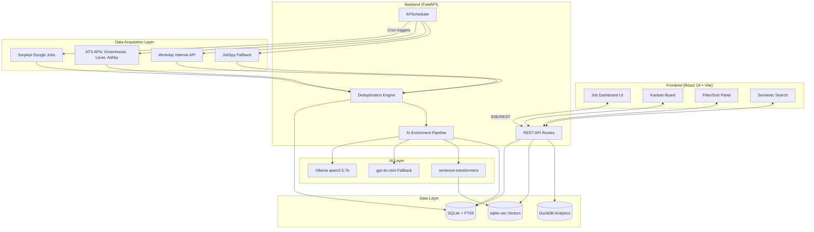

# RESEARCH.md — Job Aggregator Architectural Bible

## Executive summary

**The fastest path to a production-quality local job aggregator is a three-tier strategy: Google Jobs via SerpApi as the primary aggregation layer (~$50/month for 5,000 searches), direct ATS API calls to Greenhouse/Lever/Ashby for company-specific depth (free, unauthenticated), and JobSpy as a free fallback scraper.** This approach sidesteps the anti-bot arms race entirely — Google handles the scraping of LinkedIn, Indeed, and Glassdoor, while ATS APIs are public and designed for external consumption.

The recommended local stack is **Python FastAPI + SQLite (WAL mode) + React 19 + Vite**, with APScheduler for background jobs, sqlite-vec for vector search, and Ollama (qwen2.5:7b) for AI enrichment. This architecture requires zero external services (no Redis, no PostgreSQL, no Docker) and runs from a single `make dev` command. The entire system stores data in one SQLite file, embeds job descriptions locally for semantic matching, and costs under **$55/month** in API fees for comprehensive coverage across all major job boards.

---

## Final stack recommendation

| Layer | Technology | Justification |
|-------|-----------|---------------|
| **Backend** | Python 3.12 + FastAPI + SQLAlchemy 2.0 async | ML ecosystem access, async on par with Node.js (~4,355 req/s), APScheduler integration |
| **Database** | SQLite (WAL mode) + DuckDB (analytics) | Zero-ops, FTS5 handles 500K+ records in <100ms, DuckDB 20–50× faster for dashboards |
| **Frontend** | React 19 + Vite + TailwindCSS v4 + Zustand | Largest ecosystem, TanStack Virtual for 10K+ lists, dnd-kit for kanban |
| **Scheduler** | APScheduler (SQLAlchemy job store) | In-process, persistent to SQLite, cron triggers, zero external dependencies |
| **Vector search** | sentence-transformers (all-MiniLM-L6-v2) + sqlite-vec | Single-file, SIMD-accelerated, <50ms for 50K vectors on Apple Silicon |
| **LLM** | Ollama qwen2.5:7b (local) + gpt-4o-mini (fallback) | Best structured extraction quality locally; $0.42 per 1,000 jobs as cloud fallback |
| **Primary data** | SerpApi Google Jobs + Greenhouse/Lever/Ashby APIs | Legal, structured JSON, aggregates all major boards |
| **Fallback scraper** | JobSpy (python-jobspy) | Free, scrapes LinkedIn/Indeed/Glassdoor/Google/ZipRecruiter concurrently |
| **Package mgmt** | uv (Python) + pnpm (frontend) + Makefile | 10–100× faster than pip, workspace support, unified commands |

### Architecture diagram



---

## R1 — Scraping API landscape analysis

### Master comparison table

| API | Type | Free Tier | Starting Price | Cost/1K Jobs | Latency | LinkedIn | Indeed | Google Jobs | ATS Pages | Auth | Python SDK |
|-----|------|-----------|---------------|-------------|---------|----------|--------|-------------|-----------|------|-----------|
| **SerpApi** | Search parser | 250/mo | $25/mo | $10–25 | 1–3s | Via Google | Via Google | ✅ Native | Via Google | API key | ✅ `serpapi` |
| **SearchAPI.io** | Search parser | 100/mo | $40/mo | $1–4 | 1.3–2.2s | Via Google | Via Google | ✅ Native | Via Google | API key / Bearer | ❌ REST only |
| **TheirStack** | Job-specific | 200 credits/mo | $59/mo | ~$3–13 | Real-time | ✅ Direct | ✅ Direct | Indirect | Partial | Bearer | ❌ Code examples |
| **Apify** | Actor platform | $5/mo credits | $39/mo + actor | $1–5 + compute | ~13.7s | ✅ Actor | ✅ Actor | ✅ Actor | Via Google | API token | ✅ `apify-client` |
| **Bright Data** | Scraper + datasets | ~100 records trial | $499/mo | $0.75–1.50 | ~10.6s | ✅ Direct | ✅ Direct | Via SERP API | Custom scraper | Bearer | ❌ REST only |
| **Coresignal** | B2B data | 200 credits | $49/mo | Enterprise | 176ms | ✅ | ✅ | ❌ | ❌ | API key | ❌ REST only |
| **Firecrawl** | General scraper | 500 one-time | $16/mo | DIY parsing | 2–5s | DIY | DIY | DIY | DIY | Bearer | ✅ `firecrawl-py` |
| **ScrapingBee** | General scraper | 1,000 trial | $49/mo | DIY parsing | ~11.9s | DIY | DIY | ✅ Google Jobs | DIY | API key (param) | ✅ `scrapingbee` |
| **ScraperAPI** | General proxy | 5,000 trial | $49/mo | DIY parsing | 5.7s | DIY | DIY | Structured | DIY | API key (param) | ✅ Docs |
| **JSearch (RapidAPI)** | Google Jobs | ~100–500/mo | ~$20/mo | ~$2–4 | 1–8s | Via Google | Via Google | ✅ Native | Via Google | X-RapidAPI-Key | ❌ HTTP |
| **JobsPikr** | Job data platform | Free trial | ~$79–333/mo | Enterprise | N/A | ✅ | ✅ | ❌ | ❌ | API key | ❌ REST only |
| **ProxyCurl** | ⚠️ **SHUT DOWN** | — | — | — | — | Was LinkedIn only | ❌ | ❌ | ❌ | — | — |

### Per-API deep dives

#### SerpApi — Recommended primary source

SerpApi parses Google Jobs results into structured JSON through a single endpoint: `GET https://serpapi.com/search?engine=google_jobs`. Since Google Jobs aggregates from LinkedIn, Indeed, Glassdoor, ZipRecruiter, and company career pages, **this single API effectively covers all major job boards**. The free tier provides **250 searches/month**, with paid plans from $25/month (1,000 searches) to $275/month (30,000 searches). Only successful searches count — cached results (1-hour TTL) are free. SerpApi includes a **U.S. Legal Shield on all plans**, assuming scraping liabilities for users. SDKs exist for Python (`serpapi`), Node.js, Ruby, PHP, Java, Rust, Go, and more. Response time averages **1–3 seconds**. The `jobs_results[]` array returns title, company, location, full description, `job_highlights` (qualifications, responsibilities, benefits), `detected_extensions` (salary, schedule, remote status), and `apply_options` with direct links to the original posting on LinkedIn, Glassdoor, or the company site.

#### SearchAPI.io — Drop-in SerpApi alternative

Nearly identical to SerpApi in functionality with a **more generous free tier (100/month) and lower per-search cost** at scale ($1–4/1K vs $10–25/1K). The endpoint is `GET https://www.searchapi.io/api/v1/search?engine=google_jobs`. The response schema uses `jobs[]` instead of `jobs_results[]` and includes `apply_link` directly. Legal protection guarantee of up to **$2M** on Production plans and above. No dedicated SDKs — REST API only. Response time is **1.3–2.2 seconds**, with a 99.9% SLA on paid plans. Supports both API key query parameter and Bearer token authentication.

#### TheirStack — Best for direct job data enrichment

TheirStack aggregates from **312,000+ sources across 195 countries**, processing **225K+ jobs/day** with 171M+ total jobs in its database. Unlike SerpApi (which scrapes Google), TheirStack scrapes job boards and career pages directly, deduplicating across sources. Data is enriched with technology detection (32K+ technologies), predicted salary/seniority via NLP, and company firmographics (funding, revenue, headcount). Free tier: **50 company credits + 200 API credits/month**. Paid plans start at **$59/month**. Rate limits: 2 req/sec (free), 4 req/sec (paid). Authentication is Bearer token. No dedicated SDK, but well-documented REST API with Python/Node.js examples.

#### Apify — Best actor marketplace for specialized scraping

Apify's marketplace offers pre-built actors for specific platforms. The **Indeed Scraper** (`misceres/indeed-scraper`) costs **$5/1K results** and returns `positionName`, `salary`, `company`, `location`, `description`, `postedAt`, `scrapedAt`. The **LinkedIn Jobs Scraper** (`curious_coder/linkedin-jobs-scraper`) costs only **$1/1K results** with a 4.8/5 rating and 11K users — it overcomes LinkedIn's 1,000-job-per-search limit via location splitting. The **Google Jobs Scraper** (`orgupdate/google-jobs-scraper`) aggregates across boards. Platform pricing: Free ($5/month credits), Starter ($39), Scale ($199), Business ($999). Actor fees are **additive on top of compute costs**. Python and Node.js SDKs available (`apify-client`). Median latency is ~13.7 seconds — the slowest option but most feature-complete for direct platform scraping.

#### Bright Data — Enterprise-grade but expensive

Two products: **Web Scraper API** ($1.50/1K records pay-as-you-go, $0.75/1K on subscription) and **Pre-built Datasets** ($250/100K records). Dedicated scrapers for LinkedIn Jobs, Indeed, and Glassdoor return parsed structured JSON. The cheapest meaningful plan is **$499/month for 510K records**. Best for bulk historical data needs. **150M+ residential IPs** across 195 countries. Average response time ~10.6 seconds. ISO 27001 certified, GDPR/CCPA compliant.

#### Coresignal — Fastest response time

Average API response of **176ms** — fastest in the comparison. Covers LinkedIn, Indeed, Glassdoor, and Wellfound with **260M+ job posting records**. Three processing tiers: Base (structured), Clean (deduplicated), Multi-source (enriched). Self-service API starts at **$49/month**, but dataset access requires sales consultation. Best for users needing pre-processed, multi-source B2B data.

#### Firecrawl — Best for AI extraction

Open-source (AGPL-3.0), self-hostable general scraping API. Returns **LLM-ready Markdown** (67% fewer tokens than HTML). The `/extract` endpoint uses natural language to describe what to extract — ideal for unstructured career pages. Free: **500 credits one-time**. Hobby: **$16/month for 3,000 credits**. Standard: **$83/month for 100K credits**. GitHub: 86K+ stars. SOC 2 Type 2 certified. Best used for scraping company career pages that don't use standard ATS platforms.

#### RapidAPI JSearch — Simplest Google Jobs wrapper

JSearch by OpenWeb Ninja wraps Google Jobs with **30+ data points per listing**, including `job_min_salary`, `job_max_salary`, `job_required_skills`, `job_required_experience`, and salary estimation. Free tier ~100–500 requests/month. Pro ~$20/month. Authenticated via `X-RapidAPI-Key` header. Response time 1–8 seconds. Returns up to 500 results per query. A simpler (and potentially cheaper) alternative to SerpApi for Google Jobs specifically.

#### ScrapingBee and ScraperAPI — General proxied scraping

Both are general-purpose scraping proxies returning raw HTML by default. ScrapingBee starts at $49/month (250K credits) but JS rendering consumes **5× credits** and premium proxies consume **25× credits** — making effective cost much higher. ScraperAPI has a 60.8% average success rate on protected sites and 5.7-second average latency. Neither provides pre-structured job data. **Not recommended as primary job data sources** — use only if you need to scrape a specific page that no other API covers.

#### JobsPikr — Enterprise job analytics

Processes **1M+ listings daily** from 70K+ employer websites. Data is parsed, normalized, and AI-classified with 95%+ title accuracy and 90%+ skill extraction. Built on Elasticsearch with a Query Builder for non-technical users. Pricing is opaque — ranges from $79/month (basic) to $200K+/year (global enterprise). Rate limits: 5,000 requests/hour (data API), 100 requests/hour (aggregation API). Best for labor market analytics firms, not personal use.

---

## R2 — Target job board scraping mechanics

### Google Jobs via SerpApi — the primary aggregation layer

Google Jobs is the **meta-search engine** that aggregates from LinkedIn, Indeed, Glassdoor, ZipRecruiter, and thousands of company career pages. Using SerpApi or SearchAPI to query Google Jobs provides comprehensive coverage without scraping any job board directly.

**Endpoint:** `GET https://serpapi.com/search?engine=google_jobs`

**Key parameters:**

| Parameter | Required | Description |
|-----------|----------|-------------|
| `q` | Yes | Search query (e.g., "software engineer") |
| `location` | No | City-level location (e.g., "San Francisco, CA") |
| `gl` | No | Country code (e.g., "us") |
| `hl` | No | Language code (e.g., "en") |
| `chips` | No | Filters (e.g., `date_posted:today`, `employment_type:FULLTIME`) |
| `start` | No | Pagination offset (increments of 10) |
| `no_cache` | No | Force fresh results (1-hour cache default) |

**Response `jobs_results[]` JSON schema:**

```json
{
  "title": "Senior Software Engineer",
  "company_name": "Google",
  "location": "Mountain View, CA",
  "via": "via LinkedIn",
  "description": "Full job description text...",
  "job_highlights": [
    { "title": "Qualifications", "items": ["5+ years experience", "BS in CS"] },
    { "title": "Responsibilities", "items": ["Lead feature discussions"] },
    { "title": "Benefits", "items": ["Health insurance", "401k matching"] }
  ],
  "detected_extensions": {
    "posted_at": "3 days ago",
    "schedule_type": "Full-time",
    "salary": "$120K–$180K a year",
    "work_from_home": true
  },
  "apply_options": [
    { "title": "LinkedIn", "link": "https://www.linkedin.com/jobs/view/..." },
    { "title": "Glassdoor", "link": "https://www.glassdoor.com/job-listing/..." }
  ],
  "job_id": "eyJqb2JfdGl0bGUiOi...",
  "extensions": ["3 days ago", "Full-time", "$120K–$180K", "Health insurance"]
}
```

**Maximizing results:** Google caps at ~100–150 results per query. To maximize coverage, split searches by location (city-level), job type, and seniority. Use `uds` filter values returned in the response's `filters` array. Run multiple targeted queries rather than one broad query. Google re-indexes jobs via its Indexing API — new jobs appear within **minutes to hours** if the employer uses it, or **1–3 days** via standard crawling.

**Recommended polling interval:** Every **2–4 hours** for active monitoring.

### LinkedIn Jobs — avoid direct scraping

LinkedIn deploys the most aggressive anti-bot system among job boards. It returns **HTTP 999** for detected bots, uses browser fingerprinting (canvas, WebGL, TLS), behavioral analysis (mouse movements, scroll patterns), and account trust scoring. **ProxyCurl shut down in July 2025** due to a LinkedIn lawsuit, and LinkedIn sued ProAPIs in 2025 for creating fake accounts. Direct scraping of LinkedIn violates its ToS and carries real legal risk.

**Recommended approach:** Access LinkedIn job data indirectly through **Google Jobs** (LinkedIn listings appear in Google's aggregation with `via LinkedIn` attribution and direct apply links). For LinkedIn-specific metadata (seniority level, job functions), use **Apify's LinkedIn Jobs Scraper** ($1/1K results, handles anti-bot) or **Serpdog** (`api.serpdog.io/linkedin_jobs`, 5 credits/call).

**Polling interval:** Every **6–12 hours** minimum if scraping directly. Through Google Jobs, the standard 2–4 hour interval applies.

### Indeed — API-only approach recommended

Indeed shut down its public Job Search API years ago. In 2025–2026, Indeed uses aggressive anti-bot defenses including Cloudflare Turnstile, IP tracking, JavaScript challenges, and a registration wall that blocks pagination without login. Datacenter IPs are blocked almost instantly.

**Recommended approach (ranked):**
1. **Google Jobs via SerpApi** — Indeed listings appear in aggregated results
2. **Bright Data Indeed Scraper** — $1/1K records, handles anti-bot, returns structured JSON
3. **Apify Indeed Scraper** (`misceres/indeed-scraper`) — $5/1K results, community-maintained
4. **JobSpy** (`pip install python-jobspy`) — free but high block risk at scale

**Polling interval:** Every **4–6 hours** via Google Jobs; daily for Bright Data datasets.

### Glassdoor — access only through aggregators

Glassdoor has **no public API** and uses Cloudflare protection, login overlays after 2–3 page views, and dynamic JavaScript rendering. Direct scraping is unreliable.

**Recommended approach:** Access via **Google Jobs** (Glassdoor listings appear in `apply_options[]`). For Glassdoor-specific data (employer ratings, salary estimates, reviews), use **Bright Data's Glassdoor Scraper** ($0.001/record).

**Polling interval:** Every **12–24 hours** if scraping directly.

### Greenhouse — easiest ATS, fully public API

Greenhouse provides a **fully public, unauthenticated Job Board API**. No API key, no rate limit documentation, no authentication required.

**List all jobs:**
```
GET https://boards-api.greenhouse.io/v1/boards/{board_token}/jobs?content=true
```

**Single job with salary and application form:**
```
GET https://boards-api.greenhouse.io/v1/boards/{board_token}/jobs/{job_id}?questions=true&pay_transparency=true
```

**Response schema (with `?content=true`):**
```json
{
  "jobs": [{
    "id": 127817,
    "internal_job_id": 144381,
    "title": "Vault Designer",
    "updated_at": "2016-01-14T10:55:28-05:00",
    "requisition_id": "50",
    "location": { "name": "NYC" },
    "absolute_url": "https://boards.greenhouse.io/vaulttec/jobs/127817",
    "content": "<p>HTML job description...</p>",
    "departments": [{ "id": 1, "name": "Engineering" }],
    "offices": [{ "id": 1, "name": "New York", "location": "New York, NY" }]
  }],
  "meta": { "total": 42 }
}
```

With `?pay_transparency=true`, jobs include `pay_input_ranges[]` with `min_cents`, `max_cents`, `currency_type`. Company slugs are discoverable via Google: `site:boards.greenhouse.io {company_name}`. Example slugs: `discord`, `figma`, `notion`, `airbnb`.

**Polling interval:** Every **4–6 hours**.

### Lever — simple public postings API

**List all postings:**
```
GET https://api.lever.co/v0/postings/{site_name}?mode=json
```

**Query parameters:** `skip`, `limit` (pagination), `team`, `department`, `location`, `commitment` (filters), `group` (group by field).

**Response schema:**
```json
{
  "id": "posting-uuid",
  "text": "Job Title",
  "categories": {
    "team": "Engineering",
    "department": "Product",
    "location": "San Francisco, CA",
    "commitment": "Full-time",
    "level": "Senior"
  },
  "description": "<div>HTML description</div>",
  "descriptionPlain": "Plain text description",
  "lists": [{ "text": "Requirements", "content": "<li>Req 1</li>" }],
  "hostedUrl": "https://jobs.lever.co/company/posting-id",
  "applyUrl": "https://jobs.lever.co/company/posting-id/apply",
  "createdAt": 1609459200000,
  "workplaceType": "remote",
  "salaryRange": { "currency": "USD", "interval": "per-year", "min": 100000, "max": 150000 }
}
```

No authentication required for GET requests. CORS is restricted to company domains, but server-side requests work fine. Example slugs: `netflix`, `cloudflare`, `lever`.

**Polling interval:** Every **4–6 hours**.

### Ashby — clean API with compensation data

**List all jobs:**
```
GET https://api.ashbyhq.com/posting-api/job-board/{job_board_name}?includeCompensation=true
```

**Response schema:**
```json
{
  "jobs": [{
    "title": "Product Manager",
    "location": "Houston, TX",
    "department": "Product",
    "team": "Growth",
    "isRemote": true,
    "workplaceType": "Remote",
    "employmentType": "FullTime",
    "descriptionHtml": "<p>Join our team</p>",
    "descriptionPlain": "Join our team",
    "publishedAt": "2021-04-30T16:21:55.393+00:00",
    "jobUrl": "https://jobs.ashbyhq.com/example_job",
    "applyUrl": "https://jobs.ashbyhq.com/example/apply",
    "compensation": {
      "compensationTierSummary": "$81K – $87K • 0.5% – 1.75%",
      "compensationTiers": [{
        "title": "Zone A",
        "components": [{
          "compensationType": "Salary",
          "interval": "1 YEAR",
          "currencyCode": "USD",
          "minValue": 81000,
          "maxValue": 87000
        }]
      }]
    },
    "secondaryLocations": [{ "location": "San Francisco" }]
  }]
}
```

No authentication required. Includes structured compensation with tiers, equity, and bonus components. Example slugs: `ramp`, `Ashby`. Discoverable via `site:jobs.ashbyhq.com {company}`.

**Polling interval:** Every **4–6 hours**.

### Workday — complex but workable internal API

Workday career sites are JavaScript SPAs with no public API. However, the frontend makes XHR requests to an undocumented internal JSON API:

**Search jobs:**
```
POST https://{company}.wd{N}.myworkdayjobs.com/wday/cxs/{company}/{site_path}/jobs
Content-Type: application/json

{ "appliedFacets": {}, "limit": 20, "offset": 0, "searchText": "software engineer" }
```

**Job detail:**
```
GET https://{company}.wd{N}.myworkdayjobs.com/wday/cxs/{company}/{site_path}/job/{job_id}
```

URL patterns vary per company (e.g., `mastercard.wd1.myworkdayjobs.com/CorporateCareers`). Each company configures their own subdomain and datacenter number (wd1–wd5). Residential proxies recommended for reliability. Complexity is **high** — requires reverse-engineering per-company URL patterns.

**Polling interval:** Every **6–12 hours**.

### BambooHR, Handshake, and Wellfound

**BambooHR** requires per-company API keys for programmatic access. Career pages exist at `{companyDomain}.bamboohr.com/careers` but have no public JSON API. Scrape HTML or use authenticated API. **Complexity: Medium.**

**Handshake** is fully gated behind university SSO. No public API or practical scraping approach. **Not viable for external aggregation.**

**Wellfound** (formerly AngelList Talent) uses Apollo GraphQL with data embedded in server-rendered HTML as `__APOLLO_STATE__`. Requires Cloudflare bypass via residential proxies or anti-bot services. Apify actors exist (`wellfound-jobs-scraper`). **Complexity: High.** Polling interval: every 12–24 hours.

---

## R3 — Data schema and normalization

### Normalized job record schema

```sql
CREATE TABLE jobs (
    -- Identity & dedup
    id              TEXT PRIMARY KEY,        -- UUID v4
    source_hash     TEXT NOT NULL UNIQUE,    -- SHA-256(source + source_id) for dedup
    source          TEXT NOT NULL,           -- enum: google_jobs, greenhouse, lever, ashby,
                                            --       workday, indeed, linkedin, glassdoor,
                                            --       wellfound, ziprecruiter, jobspy
    source_id       TEXT,                    -- Original ID from source platform

    -- Core fields
    title           TEXT NOT NULL,
    company_name    TEXT NOT NULL,
    company_domain  TEXT,                    -- e.g., "stripe.com"
    location_raw    TEXT,                    -- Original location string
    location_city   TEXT,
    location_state  TEXT,
    location_country TEXT DEFAULT 'US',
    remote_type     TEXT,                    -- enum: onsite, remote, hybrid
    url             TEXT NOT NULL,           -- Canonical apply link
    posted_at       TEXT,                    -- ISO 8601
    scraped_at      TEXT NOT NULL DEFAULT (datetime('now')),
    is_active       INTEGER NOT NULL DEFAULT 1,

    -- Content
    description_raw TEXT,                    -- Original HTML
    description_clean TEXT,                  -- Stripped plaintext
    description_md  TEXT,                    -- Markdown (for LLM input)
    requirements    TEXT,                    -- JSON array of strings
    responsibilities TEXT,                   -- JSON array of strings
    salary_min      INTEGER,
    salary_max      INTEGER,
    salary_currency TEXT DEFAULT 'USD',
    salary_period   TEXT,                    -- enum: hourly, annual

    -- Classification
    job_type        TEXT,                    -- enum: full_time, part_time, contract, intern
    experience_level TEXT,                   -- enum: entry, mid, senior, lead, executive
    department      TEXT,
    industry        TEXT,

    -- AI-enriched (populated async)
    skills_required TEXT,                    -- JSON array
    skills_nice     TEXT,                    -- JSON array
    tech_stack      TEXT,                    -- JSON array
    seniority_score INTEGER,                -- 0-100
    remote_score    INTEGER,                -- 0-100
    match_score     INTEGER,                -- 0-100 vs user resume
    summary_ai      TEXT,                   -- 150-word AI summary
    red_flags       TEXT,                    -- JSON array
    green_flags     TEXT,                    -- JSON array

    -- User tracking
    status          TEXT DEFAULT 'new',     -- enum: new, saved, applied, rejected,
                                            --       ghosted, interviewing, offer
    notes           TEXT,
    applied_at      TEXT,
    is_starred      INTEGER DEFAULT 0,
    tags            TEXT,                    -- JSON array
    last_updated    TEXT NOT NULL DEFAULT (datetime('now'))
);

-- Indexes for performance
CREATE INDEX idx_jobs_company ON jobs(company_name);
CREATE INDEX idx_jobs_status ON jobs(status);
CREATE INDEX idx_jobs_posted ON jobs(posted_at DESC);
CREATE INDEX idx_jobs_match ON jobs(match_score DESC);
CREATE INDEX idx_jobs_source ON jobs(source);
CREATE INDEX idx_jobs_active ON jobs(is_active) WHERE is_active = 1;

-- Full-text search
CREATE VIRTUAL TABLE jobs_fts USING fts5(
    title, company_name, description_clean, skills_required, tech_stack,
    content='jobs', content_rowid='rowid'
);

-- Vector embeddings
CREATE VIRTUAL TABLE jobs_vec USING vec0(
    job_id TEXT PRIMARY KEY,
    embedding FLOAT[384]    -- all-MiniLM-L6-v2 dimension
);
```

### Deduplication logic

Cross-source dedup uses a three-layer approach:

**Layer 1 — URL dedup:** Normalize URLs (strip UTM params, trailing slashes, www prefix) and compare. Same URL = same job.

**Layer 2 — Source hash dedup:** Generate `SHA-256(source_platform + source_job_id)`. Each source provides its own ID — a Greenhouse `job_id` of `127817` on source `greenhouse` produces a unique hash. Prevents re-inserting the same job from the same source.

**Layer 3 — Fuzzy cross-source dedup:** The same job posted on LinkedIn, Indeed, and Greenhouse needs matching. Use a composite key:
```python
def cross_source_key(job):
    company = normalize_company(job.company_name)  # lowercase, strip Inc/LLC/etc
    title = normalize_title(job.title)              # lowercase, strip seniority prefixes
    location = normalize_location(job.location_city, job.location_state)
    return f"{company}|{title}|{location}"
```

When a new job matches an existing `cross_source_key`, merge: keep the richest description, earliest `posted_at`, and collect all `apply_options` URLs. Mark the record with all source platforms.

### Incremental refresh strategy

| Source | Polling Interval | Strategy |
|--------|-----------------|----------|
| SerpApi (Google Jobs) | Every 3 hours | Paginate through `next_page_token`; check `posted_at` for freshness |
| Greenhouse API | Every 6 hours | Compare `updated_at` field; only process changed jobs |
| Lever API | Every 6 hours | Full fetch (no incremental endpoint); diff against stored `createdAt` |
| Ashby API | Every 6 hours | Full fetch; diff against stored `publishedAt` |
| Workday API | Every 12 hours | Paginate with offset; diff against stored titles+locations |
| JobSpy fallback | Every 12 hours | Use `hours_old=12` filter; dedup against existing records |

**Staleness check:** Mark jobs as `is_active = 0` if they disappear from source for **3 consecutive scrapes**. For Google Jobs, jobs typically expire from results within 30 days.

### Schema versioning

Use SQLite's `user_version` pragma for schema migrations:
```python
CURRENT_SCHEMA_VERSION = 3

def migrate(db):
    version = db.execute("PRAGMA user_version").fetchone()[0]
    if version < 1:
        db.execute("ALTER TABLE jobs ADD COLUMN remote_score INTEGER")
    if version < 2:
        db.execute("ALTER TABLE jobs ADD COLUMN tags TEXT")
    if version < 3:
        db.execute("ALTER TABLE jobs ADD COLUMN summary_ai TEXT")
    db.execute(f"PRAGMA user_version = {CURRENT_SCHEMA_VERSION}")
```

---

## R4 — Local technology stack selection

### Backend: FastAPI + SQLAlchemy 2.0 async

FastAPI with async drivers achieves **~4,355 req/s**, on par with Node.js Fastify (~4,145 req/s). The decisive advantage is Python's ML ecosystem — sentence-transformers, Ollama bindings, ChromaDB, pandas, and BeautifulSoup all run natively without subprocess bridging. SQLAlchemy 2.0's fully async ORM with `aiosqlite` provides type-annotated, well-documented database operations. Web scraping in Python (httpx, BeautifulSoup, Playwright) is vastly superior to Node.js alternatives.

Node.js with Fastify + Drizzle ORM was considered. Drizzle offers excellent TypeScript DX, but forces Python subprocess calls for all ML/embedding work. `node-cron` has **no job persistence on restart** — a critical gap. BullMQ requires Redis, which is overkill for a local app.

### Database: SQLite (WAL mode) + DuckDB analytics

SQLite handles 500K+ records with FTS5 full-text search in **<100ms per query**. WAL mode enables concurrent readers with one writer — ideal for async backends. Configure with:
```sql
PRAGMA journal_mode = WAL;
PRAGMA busy_timeout = 5000;
PRAGMA synchronous = NORMAL;
PRAGMA cache_size = -64000;  -- 64MB cache
```

DuckDB queries SQLite tables **directly** via its `sqlite_scanner` extension — zero data migration required. Analytical queries (aggregations, window functions, dashboards) run **20–50× faster** than SQLite. Use SQLite for OLTP (inserts, updates, point lookups) and DuckDB for OLAP (salary distributions, skill frequency charts, jobs-per-week graphs).

PostgreSQL was rejected because it adds server management complexity for zero benefit in a single-user local app. The only advantage (concurrent writes) is irrelevant here.

### Frontend: React 19 + Vite + TailwindCSS v4

**Virtual scrolling:** TanStack Virtual is the clear leader — headless, framework-agnostic, 10–15KB, supports vertical/horizontal/grid virtualization for 10K+ record lists.

**State management:** Zustand (~3KB) for UI state (filters, kanban positions, selected jobs) alongside TanStack Query for server data fetching. Community consensus in 2025–2026: "Zustand has emerged as the versatile middle ground."

**Kanban board:** `dnd-kit` — the recommended modern drag-and-drop library since `react-beautiful-dnd` was deprecated by Atlassian. 10KB, zero dependencies, keyboard/screen-reader accessible, built for React with a hooks API.

**Real-time updates:** Server-Sent Events (SSE) from FastAPI for scraping progress notifications and new job alerts. SSE is simpler than WebSockets for unidirectional updates.

Next.js was rejected because SSR adds build complexity for zero benefit on localhost. SvelteKit was considered for its 1.6KB runtime (vs React's 42KB), but the ecosystem gap in kanban board libraries, virtual scrolling solutions, and component libraries is decisive.

### Scheduler: APScheduler with SQLAlchemy job store

APScheduler runs **in-process** with FastAPI — no separate worker, no Redis, no Docker. Jobs persist to the same SQLite database via SQLAlchemy job store, surviving app restarts. Supports cron triggers, interval triggers, and `misfire_grace_time` for handling missed jobs when the app was closed.

```python
from apscheduler.schedulers.asyncio import AsyncIOScheduler
from apscheduler.jobstores.sqlalchemy import SQLAlchemyJobStore

scheduler = AsyncIOScheduler(
    jobstores={"default": SQLAlchemyJobStore(url="sqlite:///jobs.db")},
    job_defaults={"coalesce": True, "max_instances": 1, "misfire_grace_time": 3600}
)

# Per-source configurable intervals
scheduler.add_job(scrape_google_jobs, "interval", hours=3, id="google_jobs")
scheduler.add_job(scrape_greenhouse, "interval", hours=6, id="greenhouse")
scheduler.add_job(scrape_lever, "interval", hours=6, id="lever")
scheduler.add_job(scrape_ashby, "interval", hours=6, id="ashby")
scheduler.add_job(enrich_new_jobs, "interval", minutes=30, id="ai_enrichment")
```

Celery + Redis and BullMQ were rejected as overkill — both require external services for a single-user local application.

### Vector search: sentence-transformers + sqlite-vec

**all-MiniLM-L6-v2** (384 dimensions, ~100MB) encodes at **~1,300 sentences/second** with batch processing on CPU. Encoding 50K job descriptions takes ~40–80 seconds — acceptable as a batch operation. For faster encoding, consider `Model2Vec` (potion-base-8M) at 500× faster with ~90% quality.

**sqlite-vec** stores vectors directly in SQLite as a virtual table. Written in pure C with SIMD acceleration (AVX/NEON). Cosine similarity search over 50K vectors at 384 dimensions takes **<50ms on M1/M2 Mac**. This is a Mozilla Builders project with LangChain integration.

```python
# Embedding and storing
from sentence_transformers import SentenceTransformer
model = SentenceTransformer('all-MiniLM-L6-v2')
embedding = model.encode(job_description)

# sqlite-vec query
db.execute("""
    SELECT job_id, distance 
    FROM jobs_vec 
    WHERE embedding MATCH ? 
    ORDER BY distance 
    LIMIT 20
""", [embedding.tobytes()])
```

ChromaDB was rejected because it adds a separate storage system. For <100K vectors, sqlite-vec is simpler (same SQLite file) and fast enough.

### LLM enrichment: Ollama qwen2.5:7b + gpt-4o-mini fallback

**qwen2.5:7b** (Q4_K_M quantization) runs at **~20–40 tok/s on M1/M2 Mac** (6GB RAM). It outperforms llama3.2:3b at structured JSON extraction — superior instruction following and schema adherence. Processing a 2,000-token job description takes ~7 seconds.

Ollama natively supports structured output via the `format` parameter with a JSON schema:

```python
from ollama import chat
from pydantic import BaseModel

class JobEnrichment(BaseModel):
    skills_required: list[str]
    skills_nice_to_have: list[str]
    tech_stack: list[str]
    experience_years_min: int | None
    remote_friendly: bool
    red_flags: list[str]
    green_flags: list[str]
    summary: str

response = chat(
    model='qwen2.5:7b',
    messages=[{
        'role': 'user',
        'content': f"""Extract structured job data from this description. 
        Focus on: required skills, nice-to-have skills, tech stack, 
        minimum years of experience, remote-friendliness, red flags 
        (unrealistic requirements, toxic culture signals), green flags 
        (good benefits, growth opportunities), and a 2-sentence summary.
        
        Job Description:
        {job_description}"""
    }],
    format=JobEnrichment.model_json_schema(),
    options={'temperature': 0}
)
```

**gpt-4o-mini fallback:** $0.15/M input tokens, $0.60/M output tokens. At 2,000 input + 200 output tokens per job: **~$0.00042 per job**, or **$0.42 per 1,000 jobs**. Use the Batch API for 50% discount on non-time-sensitive processing. Reserve for complex multi-language descriptions or when local LLM fails schema validation.

### Project structure

```
job-aggregator/
├── backend/
│   ├── pyproject.toml
│   ├── src/job_aggregator/
│   │   ├── main.py              # FastAPI app + scheduler startup
│   │   ├── api/                 # Route handlers
│   │   ├── scrapers/            # Per-source scraper modules
│   │   ├── models/              # SQLAlchemy ORM models
│   │   ├── services/            # Business logic (dedup, enrichment)
│   │   ├── scheduler/           # APScheduler config + job definitions
│   │   └── ml/                  # Embeddings + LLM integration
│   └── tests/
├── frontend/
│   ├── package.json
│   ├── src/
│   │   ├── components/          # UI components (JobCard, KanbanBoard, FilterPanel)
│   │   ├── stores/              # Zustand stores
│   │   ├── hooks/               # TanStack Query hooks
│   │   └── pages/               # Dashboard, Settings, Analytics
│   └── vite.config.ts
├── pyproject.toml               # Root uv workspace
├── Makefile                     # Unified task runner
└── data/                        # SQLite database files (gitignored)
```

```makefile
dev-backend:
    cd backend && uv run uvicorn src.job_aggregator.main:app --reload --port 8000
dev-frontend:
    cd frontend && pnpm dev --port 3000
dev:
    make -j2 dev-backend dev-frontend
install:
    cd backend && uv sync
    cd frontend && pnpm install
    ollama pull qwen2.5:7b
```

---

## R5 — Anti-bot evasion and rate limiting best practices

### Header rotation with coherent fingerprints

Anti-bot systems in 2025–2026 verify consistency across multiple headers simultaneously. The `sec-ch-ua` header **must match** the Chrome version in the User-Agent — mismatched "Not A Brand" grease strings are a detection signal.

```python
import random

HEADER_PROFILES = [
    {
        "User-Agent": "Mozilla/5.0 (Windows NT 10.0; Win64; x64) AppleWebKit/537.36 (KHTML, like Gecko) Chrome/137.0.0.0 Safari/537.36",
        "sec-ch-ua": '"Google Chrome";v="137", "Not/A)Brand";v="24", "Chromium";v="137"',
        "sec-ch-ua-mobile": "?0",
        "sec-ch-ua-platform": '"Windows"',
    },
    {
        "User-Agent": "Mozilla/5.0 (Macintosh; Intel Mac OS X 10_15_7) AppleWebKit/537.36 (KHTML, like Gecko) Chrome/138.0.0.0 Safari/537.36",
        "sec-ch-ua": '"Google Chrome";v="138", "Chromium";v="138", "Not=A?Brand";v="24"',
        "sec-ch-ua-mobile": "?0",
        "sec-ch-ua-platform": '"macOS"',
    },
]

COMMON_HEADERS = {
    "Accept": "text/html,application/xhtml+xml,application/xml;q=0.9,image/avif,image/webp,*/*;q=0.8",
    "Accept-Encoding": "gzip, deflate, br",
    "Accept-Language": "en-US,en;q=0.9",
    "Connection": "keep-alive",
}

def get_headers():
    return {**COMMON_HEADERS, **random.choice(HEADER_PROFILES)}
```

Chrome now uses **reduced User-Agent strings** — minor/build/patch versions are frozen to `0.0.0`, macOS version is frozen to `10_15_7`, and Windows to `NT 10.0`. For production fingerprinting, use Apify's `browserforge` (Python) or `fingerprint-suite` (Node.js), which generate statistically realistic combinations via Bayesian networks.

### Delay intervals by platform

| Platform | Minimum Delay | Notes |
|----------|--------------|-------|
| Indeed | **5–15 seconds** random | Cloudflare Turnstile, extremely aggressive |
| LinkedIn | **10–50 seconds** random | HTTP 999 for bots, behavioral analysis |
| Glassdoor | **1–5 seconds** | Cloudflare, login walls after 2–3 views |
| Google (direct) | **10–30 seconds** | Via SerpApi = handled automatically |
| Greenhouse/Lever/Ashby APIs | **1–2 seconds** | Polite baseline; public APIs |
| General sites | **2–5 seconds** | Standard polite scraping |

Always use `random.uniform(min, max)` — never fixed intervals. Add occasional **10–30 second pauses** (10% chance) to simulate human distraction. Implement exponential backoff on 429/403 responses.

### Proxy strategy for personal use

At personal scale (~50–200 job listings/day), **proxies are unnecessary** if using proper delays and header rotation from a home IP. The recommended approach delegates heavy scraping to APIs (SerpApi, Apify) that handle proxies internally.

If direct scraping is needed and blocks occur, small residential proxy plans cost **$10–30/month** (IPRoyal, Webshare, Decodo). Datacenter proxies are useless for Indeed/LinkedIn/Glassdoor — these sites check ASN databases and block datacenter IP ranges instantly. Residential proxies achieve **85–95% success rates** on protected sites vs **20–40%** for datacenter.

### Browser automation: Playwright + stealth

For JavaScript-heavy pages (Workday, Wellfound), use **Playwright + playwright-stealth** as the default:

```python
from playwright.async_api import async_playwright
from playwright_stealth import Stealth

async def scrape_workday(company_url):
    async with Stealth().use_async(async_playwright()) as p:
        browser = await p.chromium.launch(headless=False)  # headless=False for max stealth
        page = await browser.new_page()
        await page.goto(company_url)
        content = await page.content()
        await browser.close()
        return content
```

For tougher anti-bot systems (Cloudflare Turnstile, DataDome), upgrade to **Camoufox** — a Firefox fork modified at the C++ engine level that achieves 0% detection on standard tests. It passes CreepJS, BrowserScan, and Fingerprint.com. Key insight from 2026 testing: "None of these tools work without the right IP reputation layer underneath" — even perfect fingerprints get blocked on datacenter IPs.

### Legal and ethical framework

**Personal, non-commercial scraping of public data is legal in the US.** Key precedents:

- **hiQ Labs v. LinkedIn** (9th Circuit, 2022): Scraping publicly available LinkedIn profiles does not violate the CFAA
- **Meta v. Bright Data** (N.D. Cal., 2024): ToS cannot bind non-users who scrape public data while logged out. Meta dropped the lawsuit entirely
- **Van Buren v. United States** (Supreme Court, 2021): Narrowed CFAA's "exceeds authorized access" — accessing public data is not unauthorized access

**robots.txt is not legally binding** but violating it may be cited as evidence of bad faith. Best practice: respect it as an ethical guideline.

**Risk assessment for this project:**
- Scraping public job listings via API: **Very Low** risk
- Using SerpApi/Apify (they assume liability): **Very Low** risk
- Calling public ATS APIs (Greenhouse/Lever/Ashby): **Essentially Zero** risk — these are designed for external consumption
- Direct LinkedIn scraping with login cookies: **Moderate** risk — ToS violation, account ban, potential legal action

---

## R6 — Competitive feature analysis

### Commercial competitors

**Simplify.jobs** scrapes career pages of **20,000+ companies** directly (not through job boards). Its Chrome extension autofills applications across Workday, Greenhouse, Lever, and other ATS systems — the killer UX pattern. Free tier is generous: unlimited autofill and job tracking. Paid tier ($40/month) adds AI resume builder and cover letter generator. Strength: fresh, direct-from-source data. Weakness: no proactive job matching; users must find listings themselves.

**JobRight.ai** uses AI matching against **8M+ live postings** with ~400K fresh listings daily. Each job gets a percentage-based match score. Founded by PhD-level AI team, raised $7.7M (Indeed's venture arm participated). Has an insider/referral network that surfaces alumni connections. Paid tier is $30/month. Strength: strongest AI matching. Weakness: US-only, auto-apply in beta, reports of expired/fake listings.

**Teal HQ** is the organizational champion. Its Chrome extension bookmarks jobs from **50+ boards**, and the kanban board tracker (Bookmarked → Applied → Interview → Offer) is universally praised. Includes a CRM-style contact tracker with follow-up reminders and 40+ email templates. Resume builder with keyword gap analysis. Paid tier is $29/month. Strength: best-in-class tracking UX. Weakness: no proactive matching, no autofill.

### What to build differently

All three commercial tools share common weaknesses: **auto-apply is unreliable**, AI-generated content needs heavy editing, and pricing is opaque with no-refund policies. The opportunity is a **self-hosted tool that combines the best of each**: Simplify's direct-scraping approach, JobRight's match scoring, and Teal's kanban tracking — all running locally with full data ownership and zero subscription cost beyond API fees.

### Open-source landscape

**JobSpy** (`speedyapply/JobSpy`, ~2,800 stars) is the gold standard for multi-board scraping. It scrapes LinkedIn, Indeed, Glassdoor, Google, ZipRecruiter, and more concurrently, returning structured pandas DataFrames. Actively maintained (v1.1.82, Feb 2026). Limited to ~1,000 jobs per search per board. No UI, no dedup, no storage layer.

**ai-job-scraper** (`BjornMelin/ai-job-scraper`) is the most architecturally instructive project. It combines JobSpy (board scraping) + ScrapeGraphAI (career page scraping) + SQLite FTS5 (fast search) + local LLM (Qwen) + Streamlit dashboard. Achieves <10ms search on 500K+ records. Limitation: requires RTX 4090 for local LLM and is focused on AI/ML roles.

**JobSync** (`Gsync/jobsync`) provides the best open-source frontend reference. Built with Next.js + Shadcn UI + SQLite/Prisma + Ollama, it implements application tracking with status progression, AI resume review, and activity dashboards. No scraping — manual entry only.

**pharma-job-search** offers the best AI scoring pipeline architecture: rule-based pre-filter → AI scoring (2-stage evaluation), 3-layer dedup (URL, fuzzy company+title+state, cross-source), and multi-source parallel scraping from Indeed, LinkedIn, USAJobs, Adzuna, and Jooble.

**JobFunnel** (1,900+ stars) is an archived pioneer that validated the core workflow: scrape → dedup → CSV → status tracking. The maintainer archived it because "most job boards have moved to much more aggressive anti-bot detection" — confirming the API-first strategy.

No complete self-hosted solution exists that combines scraping + AI matching + tracking UI + vector search. This is the gap to fill.

---

## Implementation roadmap

### Phase 1 — Foundation (Week 1–2)

Set up the monorepo with uv + pnpm + Makefile. Initialize FastAPI backend with SQLAlchemy 2.0 async models and SQLite (WAL mode). Create the normalized job schema with FTS5 virtual table. Build the React frontend shell with Vite, TailwindCSS v4, and Zustand. Implement the settings page for API key management (SerpApi key, Ollama endpoint). Wire up SSE for real-time backend → frontend events.

**Deliverable:** Empty dashboard that connects to backend, stores config in SQLite.

### Phase 2 — Core scraping pipeline (Week 3–4)

Implement the SerpApi Google Jobs scraper as the primary data source. Build Greenhouse, Lever, and Ashby ATS scrapers using their public JSON APIs. Implement the three-layer dedup engine (URL normalization, source hash, fuzzy cross-source matching). Configure APScheduler with per-source cron triggers and SQLAlchemy job store. Build the scraper status dashboard showing last run time, jobs found, errors per source.

**Deliverable:** Automated scraping of Google Jobs + 3 ATS platforms on schedule, with deduped storage.

### Phase 3 — Frontend dashboard (Week 5–6)

Build the job list view with TanStack Virtual for 10K+ record rendering. Implement the filter panel (source, location, remote type, salary range, posted date, status). Build the kanban board with dnd-kit for application tracking (New → Saved → Applied → Interviewing → Offer → Rejected). Add job detail view with full description, apply links, and notes editor. Implement search (FTS5 for keyword search).

**Deliverable:** Fully functional job browsing, filtering, and application tracking UI.

### Phase 4 — AI enrichment (Week 7–8)

Integrate Ollama for structured job data extraction (skills, tech stack, red/green flags, summary). Implement the AI enrichment pipeline as a background job (APScheduler, 30-minute intervals for new unprocessed jobs). Set up sentence-transformers with all-MiniLM-L6-v2 for embedding job descriptions. Configure sqlite-vec for vector storage. Build resume upload and embedding. Implement semantic match scoring (cosine similarity between resume embedding and job embeddings). Add gpt-4o-mini fallback for failed local extractions.

**Deliverable:** Every job auto-enriched with skills, summary, and match score within 30 minutes of ingestion.

### Phase 5 — Advanced sources and polish (Week 9–10)

Add Workday scraper (internal API reverse-engineering). Integrate JobSpy as a fallback scraper for Indeed/LinkedIn/Glassdoor. Add Wellfound scraper (Apollo GraphQL cache parsing). Build the analytics dashboard with DuckDB (salary distributions, skill trends, applications per week). Implement saved searches with email-style alerts (in-app notifications). Add bulk operations (mark all as read, archive old listings). Export to CSV/JSON.

**Deliverable:** Comprehensive job coverage across all major platforms with analytics.

### Phase 6 — Optimization and resilience (Week 11–12)

Implement request header rotation with browserforge. Add exponential backoff and circuit breakers per scraping source. Build scraper health monitoring (success rates, response times, error categorization). Optimize SQLite performance (vacuum, analyze, cache tuning). Add dark mode and keyboard shortcuts. Write documentation. Package with Docker Compose for portable deployment.

**Deliverable:** Production-hardened, well-documented, distributable local application.